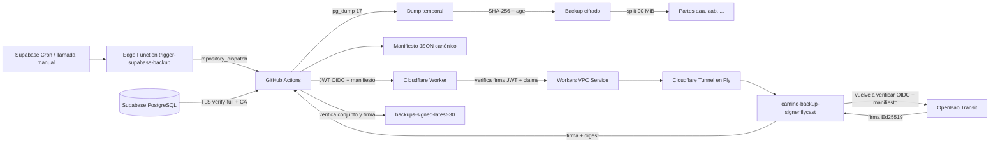
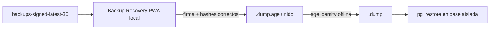

# GUÍA COMPLETA DEL BACKUP DESDE CERO

## Estado

La cadena de creación fue validada con éxito en GitHub run `30878970809`. El
sistema incluye ahora una barrera adicional: Cloudflare Worker verifica el
OIDC de GitHub antes de permitir el acceso por VPC/Tunnel al signer, y el signer
vuelve a verificarlo.

## Regla de oro

Ninguna contraseña, identidad privada `age`, token de Cloudflare, credencial
AppRole ni PAT de GitHub debe escribirse en Git o en esta documentación.

---


## Web de recuperación oficial

> [!IMPORTANT]
> Abre **[https://stjames-way.github.io/backup-recovery-pwa/](https://stjames-way.github.io/backup-recovery-pwa/)** para verificar localmente el manifiesto, la
> firma OpenBao, las partes y sus hashes, y unir el `.dump.age`. El código está
> en [https://github.com/StJames-way/backup-recovery-pwa](https://github.com/StJames-way/backup-recovery-pwa). La PWA no sube partes, no pide la identidad
> privada `age`, no descifra y no ejecuta `pg_restore`.

Consulta el capítulo **Backup Recovery PWA** de esta guía y
[`docs/recovery-pwa.md`](recovery-pwa.md).

# Arquitectura del backup firmado con verificación OIDC en Cloudflare

## Resumen

El sistema crea un dump completo de PostgreSQL, verifica el canal TLS de
Supabase, cifra el dump con `age`, construye un manifiesto determinista, exige
una identidad OIDC emitida por GitHub, valida esa identidad en **dos capas**,
firma el manifiesto con una clave Ed25519 no exportable en OpenBao Transit y
publica un snapshot de almacenamiento en una rama separada.

La barrera añadida en la arquitectura actual es **Cloudflare Backup Gateway**:
el Worker comprueba criptográficamente el JWT OIDC de GitHub antes de permitir
que la petición llegue al signer privado. El signer vuelve a validar el OIDC y
la procedencia del manifiesto. Ninguna de esas dos capas sustituye a la otra.

## Flujo de datos



## Dos rutas distintas

### Ruta del contenido de la base

```text
Supabase PostgreSQL
  -> TLS PostgreSQL verify-full
  -> runner efímero de GitHub
  -> dump plano temporal
  -> cifrado age
  -> partes cifradas en la rama de backups
```

El dump plano existe durante la ejecución dentro del runner efímero. Se elimina
al finalizar, tanto si el job termina bien como si falla. Cloudflare, Fly y
OpenBao **no reciben el dump**.

### Ruta de la firma

```text
GitHub OIDC + manifiesto
  -> Cloudflare Worker
  -> Workers VPC Service
  -> Cloudflare Tunnel
  -> Flycast privado
  -> backup-signer
  -> OpenBao Transit
```

Solo el manifiesto y la identidad OIDC atraviesan esa ruta. OpenBao firma los
bytes canónicos del manifiesto, no el archivo cifrado ni el dump plano.

## Capas de autorización

### 1. Workflow inmutable

El caller usa el reusable fijado a un SHA completo:

```text
9c1562857b371396e478fe078dd1ace772a93abc
```

No debe utilizar `@main`, una rama móvil ni un tag movible.

### 2. OIDC solicitado por GitHub

El runner solicita un token para la audiencia:

```text
openbao://supabase-backup-signing
```

El propio workflow inspecciona los claims básicos antes de enviar la petición.

### 3. Cloudflare Worker: primera verificación criptográfica

El Worker:

- exige `Bearer <JWT>`;
- limita tamaño del JWT y del cuerpo;
- descarga las claves JWKS oficiales de GitHub;
- verifica la firma `RS256` con Web Crypto;
- valida `iss`, `aud`, `exp`, `nbf`, `iat` y `jti`;
- valida repositorio, IDs inmutables, rama, evento y runner;
- valida caller workflow, reusable workflow y SHA aprobado;
- aplica rate limits por IP, token, origen y readiness;
- falla cerrado si no puede verificar el JWT;
- cachea JWKS y reintenta fallos temporales antes de devolver `503`.

Configuración de resiliencia actualmente desplegada:

```text
Intentos JWKS:            6
Timeout por intento:      15 segundos
Backoff base:             500 ms exponencial
Caché JWKS correcta:      300 segundos
Errores 4xx/5xx:          no cacheados
```

### 4. Token Worker -> signer

El Worker añade `X-Backup-Gateway-Token`. El signer lo compara en tiempo
constante antes de que FastAPI/Pydantic procese el manifiesto. El token solo
debe existir como secreto en Cloudflare y Fly.

### 5. Signer: segunda verificación OIDC

El signer vuelve a verificar el token de GitHub y coteja la procedencia del
manifiesto:

- `repository`;
- `workflow_sha`;
- `run_id`;
- `run_attempt`;
- caller y reusable permitidos;
- `ref == refs/heads/main`;
- evento permitido;
- runner alojado por GitHub.

### 6. OpenBao de mínimo privilegio

El signer obtiene un token AppRole temporal y de un solo uso. Su policy solo
permite:

```text
update transit-backup/sign/supabase-backup-manifest
```

La clave Ed25519 es no exportable y no permite descifrado ni administración.

## Supabase y TLS

El workflow usa:

```text
PGSSLMODE=verify-full
PGSSLROOTCERT=/tmp/backup-trusted/prod-ca-2021.crt
```

También exige que `SUPABASE_DB_URL` contenga exactamente una vez:

```text
sslmode=verify-full
```

La CA aprobada se valida por su huella DER SHA-256:

```text
807025ad50d4ed219d2c9c7d299c004f824eb00cf7f65afef607d07b72e6cafa
```

El usuario del pooler debe seguir el formato:

```text
backup_reader.<PROJECT_REF>
```

El rol actual tiene permisos de lectura, `BYPASSRLS`, límite de 10 conexiones y
timeouts para sesiones abandonadas. `BYPASSRLS` es deliberado para que el dump
sea completo; por eso el rol no debe recibir permisos de escritura.

## Canonicalización firmada

La firma se realiza sobre:

```python
json.dumps(
    manifest,
    sort_keys=True,
    separators=(",", ":"),
    ensure_ascii=False,
).encode("utf-8")
```

No se firma el cuerpo HTTP original ni un JSON con espacios arbitrarios.

## Estructura del snapshot

```text
encrypted_backups/
  database_backup_2026-08-04_06-53-27.dump.age.aaa.part
  database_backup_2026-08-04_06-53-27.dump.age.aab.part

manifests/
  database_backup_2026-08-04_06-53-27.json

signatures/
  database_backup_2026-08-04_06-53-27.sig
  database_backup_2026-08-04_06-53-27.json
```

Los dos JSON no colisionan porque sus rutas completas son distintas. El JSON de
`manifests/` describe el backup; el JSON de `signatures/` describe la firma.

Los sufijos `aaa`, `aab`, `aac` son el comportamiento esperado de GNU `split`
cuando se usa `--suffix-length=3` sin sufijos numéricos.

## Retención y publicación

La rama de almacenamiento es:

```text
backups-signed-latest-30
```

El workflow conserva los 30 manifiestos más recientes y elimina de forma
coordinada manifiesto, firma, metadatos y partes de los backups más antiguos.
La publicación se realiza como snapshot de un solo commit y con control de
concurrencia para evitar dos escritores simultáneos.

## Escala a cero

El signer debe conservar:

```toml
auto_stop_machines = "stop"
auto_start_machines = true
min_machines_running = 0
```

Una llamada protegida a `/readyz` debe despertar el signer mediante Flycast.
No es necesario mantener una máquina permanentemente encendida.

## Límites de confianza

- GitHub Actions conoce `SUPABASE_DB_URL` y procesa temporalmente el dump plano.
- La identidad privada `age` no está en GitHub, Cloudflare, Fly ni OpenBao.
- Cloudflare ve el JWT OIDC y el manifiesto, nunca el dump.
- El signer ve el JWT y el manifiesto, nunca la URL de Supabase ni el dump.
- OpenBao recibe exclusivamente los bytes canónicos a firmar.
- GitHub almacena únicamente material cifrado y metadatos públicos.
- El token Worker -> signer no autoriza por sí solo: todavía se exige OIDC.

## Endpoints

| Endpoint | Exposición | Finalidad |
|---|---|---|
| Worker `GET /healthz` | pública | vida básica del Worker |
| Worker `GET /readyz` | protegida | prueba profunda Worker -> signer -> OpenBao |
| Worker `POST /v1/sign` | OIDC | única entrada operativa de firma |
| Signer `GET /readyz` | ruta privada | salud de OpenBao sin consumir AppRole |
| Signer `POST /v1/sign` | token gateway + OIDC | firma del manifiesto |

## Estado de privacidad de red

La ruta operativa validada usa VPC Service, Tunnel y Flycast. No obstante, una
instalación solo puede declararse **sin entrada pública directa** después de
comprobar `fly ips list -a <signer>` y retirar todas las IP de tipo `public`.
El hecho de usar Flycast no elimina automáticamente IP públicas antiguas.


---


# Mapa de archivos

## Repositorio DB-backup

```text
.github/workflows/
  supabase-backup-dispatch.yml
  supabase-age-openbao-reusable.yml
  backup-guardian.yml
config/
  age-recipient.txt
  backup-recovery-trust.json
  backup-signing-public-key.pem
  prod-ca-2021.crt
tools/backup/
  build_manifest.py
  verify_backup_set.py
  verify_signature.py
  restore_backup.py
  verify_plaintext_dump.py
docs/
  GUIA_BACKUP_DESDE_CERO.md
  backup-architecture.md
  cloudflare-private-gateway.md
  configure-supabase-verified-tls.md
  create-backup-reader-role.sql
  current-deployment-contract.md
  disaster-recovery.md
  operations-runbook.md
  port-to-another-project.md
  recovery-drill.md
  security-boundaries.md
  troubleshooting.md
supabase/functions/trigger-supabase-backup/
```

## Repositorio/paquete signer

```text
app/
  config.py
  github_oidc.py
  main.py
  openbao.py
  perimeter.py
  schemas.py
  security.py
certs/camino-openbao-ca.pem
fly.toml
Dockerfile
openbao/backup-signer-policy.hcl
```

## Paquete Cloudflare

```text
worker/
  src/index.js
  wrangler.toml
  package.json
tunnel-fly/
  Dockerfile
  fly.toml
```

## Offline

```text
identidad privada age
copias de recuperación
actas de recovery drill
```


---


# Instalación completa desde cero

## 0. Decide el alcance

Se necesitan cuatro piezas de código y tres plataformas:

```text
DB-backup                         GitHub workflows, verificación y almacenamiento
backup-signer                    FastAPI privado en Fly
backup-signer-cloudflare/worker  gateway público con OIDC
backup-signer-cloudflare/tunnel  conector saliente cloudflared en Fly

Supabase                         origen y disparador
Cloudflare                       Worker, Tunnel y VPC Service
Fly/OpenBao                      signer privado y firma Transit
```

La identidad privada `age` queda fuera de todas ellas.

## 1. Prerrequisitos locales

Mac:

```bash
brew install age gh flyctl jq openssl@3 postgresql@17 supabase/tap/supabase node
```

Comprueba:

```bash
for TOOL in age age-keygen gh fly jq openssl pg_dump pg_restore psql   supabase node npm; do
  command -v "$TOOL" >/dev/null || echo "FALTA: $TOOL"
done
```

Windows: WSL2 Ubuntu. Linux: instala equivalentes y cliente PostgreSQL 17.

## 2. Repositorios y protección

- crea/usa el repo de backup;
- crea/usa el repo signer;
- guarda Worker/Tunnel en un repo privado o monorepo versionado;
- protege `main`;
- exige revisión para workflows, claves públicas y trust anchors;
- prohíbe force-push en `main` y en la rama de almacenamiento.

## 3. Genera la identidad `age`

```bash
umask 077
mkdir -p "$HOME/backup-recovery"
age-keygen -o "$HOME/backup-recovery/supabase-backup-age-identity.txt"
age-keygen -y "$HOME/backup-recovery/supabase-backup-age-identity.txt"   > config/age-recipient.txt
chmod 600 "$HOME/backup-recovery/supabase-backup-age-identity.txt"
```

Calcula la huella sobre el recipient sin salto final:

```bash
RECIPIENT="$(tr -d '
' < config/age-recipient.txt)"
printf '%s' "$RECIPIENT" | sha256sum
```

Actualiza trust JSON, reusable y Guardian. Conserva dos copias offline.

## 4. Crea `backup_reader`

Abre **Supabase SQL Editor**, no la terminal Zsh. Ejecuta
`docs/create-backup-reader-role.sql`, sustituye password y añade schemas.

Confirma:

```text
rolcanlogin=true
rolconnlimit=10
rolbypassrls=true
```

## 5. Descarga y fija la CA de Supabase

Guarda la CA en:

```text
config/prod-ca-2021.crt
```

Calcula huella DER e insértala en reusable/Guardian. Prueba `verify-full` con el
host exacto del Session pooler.

## 6. Configura `SUPABASE_DB_URL`

```text
postgresql://backup_reader.<PROJECT_REF>:<PASSWORD_URLENCODED>@<POOLER_HOST>:5432/postgres?sslmode=verify-full
```

```bash
printf '%s' "$SUPABASE_DB_URL" |
gh secret set SUPABASE_DB_URL --repo OWNER/REPO
```

## 7. Prepara OpenBao

Nombres actuales de referencia:

```text
Transit mount: transit-backup
Transit key:   supabase-backup-manifest
AppRole mount: approle-backup
Role:          backup-signer-gateway
Policy:        backup-signer-gateway
```

```bash
bao secrets enable -path=transit-backup transit || true
bao write transit-backup/keys/supabase-backup-manifest   type=ed25519 exportable=false allow_plaintext_backup=false

cat >/tmp/backup-signer-gateway.hcl <<'EOF'
path "transit-backup/sign/supabase-backup-manifest" {
  capabilities = ["update"]
}
EOF
bao policy write backup-signer-gateway /tmp/backup-signer-gateway.hcl
rm -f /tmp/backup-signer-gateway.hcl

bao auth enable -path=approle-backup approle || true
bao write auth/approle-backup/role/backup-signer-gateway   token_policies=backup-signer-gateway   token_no_default_policy=true   token_ttl=120s token_max_ttl=120s token_num_uses=1   secret_id_num_uses=0 local_secret_ids=true
```

Exporta la pública Transit al repo y calcula su huella DER.

## 8. Configura el signer

Fly secrets:

```text
OPENBAO_ADDR=https://<OPENBAO_APP>.internal:8200
OPENBAO_ROLE_ID
OPENBAO_SECRET_ID
BACKUP_GATEWAY_TOKEN
```

`fly.toml` debe usar:

```toml
[http_service]
internal_port = 8080
force_https = false
auto_stop_machines = "stop"
auto_start_machines = true
min_machines_running = 0
```

Configura allowlists OIDC con el repo nuevo y el SHA aprobado.

Despliega sin retirar todavía IP públicas:

```bash
fly deploy -a <SIGNER_APP>
fly ips allocate-v6 --private -a <SIGNER_APP>
```

## 9. Crea el Tunnel

En Cloudflare `Workers VPC -> Tunnels`, crea un túnel y copia su token.

```bash
cd backup-signer-cloudflare/tunnel-fly
fly apps create <TUNNEL_APP>
fly secrets set -a <TUNNEL_APP> TUNNEL_TOKEN='<TOKEN>'
fly deploy -a <TUNNEL_APP>
fly logs -a <TUNNEL_APP>
```

Debe aparecer Connected/Healthy y no tener servicio de entrada.

## 10. Crea VPC Service

```bash
npx wrangler vpc service create <SERVICE_NAME>   --type http   --tunnel-id '<TUNNEL_UUID>'   --hostname '<SIGNER_APP>.flycast'   --http-port 80
```

Inserta `service_id` en `wrangler.toml`.

## 11. Configura Worker y OIDC

Consulta IDs de GitHub:

```bash
gh api repos/OWNER/REPO --jq '{repository_id:.id, owner_id:.owner.id}'
```

Configura todos los `ALLOWED_*`, la audiencia y SHA. Carga dos secretos:

```text
BACKUP_GATEWAY_TOKEN  mismo que signer
BACKUP_HEALTH_TOKEN   distinto
```

Valida y despliega:

```bash
npm install
npm run check
npx wrangler deploy --secrets-file /tmp/backup-worker-secrets.env
```

## 12. Configura GitHub

Variables:

```text
BACKUP_AGE_RECIPIENT
BACKUP_SIGNER_URL
```

Secret:

```text
SUPABASE_DB_URL
```

Fija la huella de URL del gateway en reusable/Guardian y alinea el SHA en:

- caller;
- Worker;
- signer.

## 13. Configura la Edge Function

Nombre actual:

```text
trigger-supabase-backup
```

Secretos:

```text
GITHUB_BACKUP_DISPATCH_TOKEN
GITHUB_BACKUP_REPOSITORY_OWNER
GITHUB_BACKUP_REPOSITORY
BACKUP_AGE_RECIPIENT
SUPABASE_BACKUP_TRIGGER_SECRET
```

```bash
supabase functions deploy trigger-supabase-backup   --project-ref <PROJECT_REF> --no-verify-jwt
```

La función sigue exigiendo su propio Bearer secret.

## 14. Programa cron

Guarda el trigger secret en Supabase Vault y usa `pg_cron + pg_net`. No guardes
el PAT de GitHub en SQL.

## 15. Pruebas antes del corte

1. conexión local `backup_reader`;
2. `pg_stat_ssl = t`;
3. `/healthz` Worker 200;
4. firma anónima 401;
5. `/readyz` protegido 200 desde máquinas paradas;
6. canario GitHub success;
7. partes/manifiesto/firma presentes;
8. recovery drill en DB aislada;
9. dos canarios seguidos;
10. retirar IPs públicas del signer y repetir canario.

## 16. Evidencia de la instalación actual

El despliegue actual completó el run `30878970809` y publicó
`database_backup_2026-08-04_06-53-27` con partes `aaa` y `aab`.


---


# Variables, secretos y trust anchors

## GitHub Actions

### Variables

```text
BACKUP_AGE_RECIPIENT=age18gt5e7d48tfyhx4552kc5wyp52lt5rf34ag0sat3t4xsrg0fqg8stagvae
BACKUP_SIGNER_URL=https://camino-backup-gateway.santiago-way.workers.dev
```

### Secret

```text
SUPABASE_DB_URL
```

No necesita secretos de OpenBao ni Cloudflare.

## Worker

### Variables no secretas

```text
GITHUB_OIDC_AUDIENCE=openbao://supabase-backup-signing
JWT_LEEWAY_SECONDS=30
ALLOWED_REPOSITORY=StJames-way/DB-backup
ALLOWED_REPOSITORY_ID=1283131929
ALLOWED_REPOSITORY_OWNER_ID=297665544
ALLOWED_REF=refs/heads/main
ALLOWED_CALLER_WORKFLOW_REF=StJames-way/DB-backup/.github/workflows/supabase-backup-dispatch.yml@refs/heads/main
ALLOWED_JOB_WORKFLOW_REF=StJames-way/DB-backup/.github/workflows/supabase-age-openbao-reusable.yml@9c1562857b371396e478fe078dd1ace772a93abc
ALLOWED_JOB_WORKFLOW_SHA=9c1562857b371396e478fe078dd1ace772a93abc
ALLOWED_EVENTS=workflow_dispatch,repository_dispatch
```

### Secrets

```text
BACKUP_GATEWAY_TOKEN
BACKUP_HEALTH_TOKEN
```

## Signer Fly

### Variables/configuración

```text
GITHUB_OIDC_ISSUER=https://token.actions.githubusercontent.com
GITHUB_OIDC_AUDIENCE=openbao://supabase-backup-signing
ALLOWED_REPOSITORY=StJames-way/DB-backup
ALLOWED_REPOSITORY_ID=1283131929
ALLOWED_REPOSITORY_OWNER_ID=297665544
ALLOWED_REF=refs/heads/main
ALLOWED_JOB_WORKFLOW_REF=...@9c1562857b371396e478fe078dd1ace772a93abc
ALLOWED_CALLER_WORKFLOW_REF=...@refs/heads/main
OPENBAO_AUTH_MOUNT=approle-backup
OPENBAO_TRANSIT_MOUNT=transit-backup
OPENBAO_KEY_NAME=supabase-backup-manifest
```

### Secrets

```text
OPENBAO_ADDR
OPENBAO_ROLE_ID
OPENBAO_SECRET_ID
BACKUP_GATEWAY_TOKEN
```

## Tunnel Fly

```text
TUNNEL_TOKEN
```

## Edge Function

```text
GITHUB_BACKUP_DISPATCH_TOKEN
GITHUB_BACKUP_REPOSITORY_OWNER
GITHUB_BACKUP_REPOSITORY
BACKUP_AGE_RECIPIENT
SUPABASE_BACKUP_TRIGGER_SECRET
```

## Trust anchors versionados

```text
Age recipient SHA-256:             f59fd599322f109270cfa7fd614e38b8eb7d5ca823c0443f8f0d55651e4b31aa
Signing public key DER SHA-256:    4011dd69e227bfcf6f39b3f44b1ad499d2a582c9f3eed93d8896e61b7485ce96
Supabase CA DER SHA-256:           807025ad50d4ed219d2c9c7d299c004f824eb00cf7f65afef607d07b72e6cafa
Gateway URL SHA-256:               b8863d62b3e1202b604de3b499b9e4e99751259c68e4a706b72c0a98e6c35553
Reusable SHA:                      9c1562857b371396e478fe078dd1ace772a93abc
```

## Regla

Cualquier cambio en un trust anchor exige actualizar todos sus consumidores y
pasar Guardian + canario + recovery drill cuando corresponda.


---


# Cloudflare Backup Gateway privado

## Qué añade Cloudflare

La arquitectura anterior enviaba el OIDC directamente al signer. La actual
incorpora una barrera de borde que **verifica criptográficamente el OIDC antes
de usar la red privada hacia Fly**.

```text
GitHub Actions
  -> Worker público /v1/sign
  -> validación OIDC + rate limits + tamaño
  -> Workers VPC Service
  -> Cloudflare Tunnel
  -> Flycast
  -> signer
  -> OpenBao
```

## Componentes

### Worker `camino-backup-gateway`

Endpoints:

```text
GET  /healthz
GET  /readyz   (Bearer BACKUP_HEALTH_TOKEN)
POST /v1/sign  (Bearer GitHub OIDC)
```

El Worker nunca recibe el dump. Reenvía exclusivamente el manifiesto.

### VPC Service

Despliegue actual:

```text
ID:       019fc7fd-7d2b-7262-93cc-87f29fe2a0fc
Type:     http
Hostname: camino-backup-signer.flycast
Port:     80
Tunnel:   6606305d-934a-404e-9cda-afc36a463946
```

Para otra cuenta se crea uno nuevo y se sustituye el `service_id`.

### Tunnel connector

La app `camino-backup-tunnel` ejecuta `cloudflared` y no expone servicios de
entrada. Solo abre conexiones salientes a Cloudflare.

### Signer

Fly Proxy recibe tráfico por Flycast y despierta una máquina cuando está
parada. El signer exige además el secreto compartido `BACKUP_GATEWAY_TOKEN`.

## Configuración OIDC del Worker

Variables no secretas:

```text
GITHUB_OIDC_AUDIENCE
JWT_LEEWAY_SECONDS
ALLOWED_REPOSITORY
ALLOWED_REPOSITORY_ID
ALLOWED_REPOSITORY_OWNER_ID
ALLOWED_REF
ALLOWED_CALLER_WORKFLOW_REF
ALLOWED_JOB_WORKFLOW_REF
ALLOWED_JOB_WORKFLOW_SHA
ALLOWED_EVENTS
```

Secretos:

```text
BACKUP_GATEWAY_TOKEN
BACKUP_HEALTH_TOKEN
```

## JWKS y fail-closed

El Worker descarga:

```text
https://token.actions.githubusercontent.com/.well-known/jwks
```

Si las claves no están disponibles después de los reintentos, responde `503`
y no reenvía la petición. Si el JWT es inválido o sus claims no están
permitidos, responde `403`.

Nunca debe existir un fallback de “aceptar sin verificar”.

## Despliegue resumido

```bash
cd backup-signer-cloudflare/worker
npm install
npx wrangler login
npm run check
npx wrangler deploy --secrets-file /tmp/backup-worker-secrets.env
```

El archivo temporal contiene:

```text
BACKUP_GATEWAY_TOKEN=<mismo secreto que Fly>
BACKUP_HEALTH_TOKEN=<secreto independiente>
```

Bórralo después del despliegue.

## Crear VPC Service

```bash
npx wrangler vpc service create <NOMBRE>   --type http   --tunnel-id '<TUNNEL_UUID>'   --hostname '<SIGNER_APP>.flycast'   --http-port 80
```

Comprueba:

```bash
npx wrangler vpc service get '<SERVICE_ID>'
```

## Pruebas

### Vida básica

```bash
curl -i 'https://camino-backup-gateway.santiago-way.workers.dev/healthz'
```

### Readiness profunda

```bash
curl -i   -H "Authorization: Bearer $(cat /tmp/backup-health-token)"   'https://camino-backup-gateway.santiago-way.workers.dev/readyz'
```

Debe despertar el signer desde escala cero y devolver `200`.

### Firma anónima

```bash
curl -i -X POST   -H 'Content-Type: application/json'   --data '{"manifest":{}}'   'https://camino-backup-gateway.santiago-way.workers.dev/v1/sign'
```

Debe devolver `401`.

## Logs

```bash
npx wrangler tail camino-backup-gateway --format pretty
fly logs -a camino-backup-signer
fly logs -a camino-backup-tunnel
```

Códigos relevantes:

| Log | Significado |
|---|---|
| `github_oidc_rejected` | JWT o claims no autorizados |
| `github_oidc_verifier_unavailable` | no fue posible verificar JWKS; fail-closed |
| `github_jwks_fetch_failed` | fallo de red/DNS/timeout al descargar JWKS |
| `signer_upstream_exception` | Worker no alcanzó VPC/Tunnel/Flycast |
| `readyz_upstream_not_ready` | signer u OpenBao todavía no están listos |

## Escala a cero

No cambies `min_machines_running` a 1 para ocultar problemas de arranque. La
prueba correcta es:

```text
máquinas stopped -> /readyz -> Flycast arranca -> 200 -> autostop posterior
```

## Retirada de IP pública

Después de dos canarios correctos:

```bash
fly ips list -a camino-backup-signer
fly ips release <PUBLIC_IP> -a camino-backup-signer
```

Conserva la dirección de tipo `private ingress`. Repite el canario tras cada
cambio de red.


---


# `backup-signer`: instalación privada y variables

## Papel

El signer es una segunda barrera después de Cloudflare. No confía en que el
Worker haya validado correctamente: exige gateway token, revalida OIDC,
compara provenance y firma mediante OpenBao.

## Configuración pública

```text
GITHUB_OIDC_ISSUER=https://token.actions.githubusercontent.com
GITHUB_OIDC_AUDIENCE=openbao://supabase-backup-signing
ALLOWED_REPOSITORY=StJames-way/DB-backup
ALLOWED_REPOSITORY_ID=1283131929
ALLOWED_REPOSITORY_OWNER_ID=297665544
ALLOWED_REF=refs/heads/main
ALLOWED_JOB_WORKFLOW_REF=...@9c1562857b371396e478fe078dd1ace772a93abc
ALLOWED_CALLER_WORKFLOW_REF=...@refs/heads/main
ALLOWED_EVENTS=workflow_dispatch,repository_dispatch
OPENBAO_CA_FILE=/etc/ssl/certs/camino-openbao-ca.pem
OPENBAO_AUTH_MOUNT=approle-backup
OPENBAO_TRANSIT_MOUNT=transit-backup
OPENBAO_KEY_NAME=supabase-backup-manifest
```

## Secrets Fly

```text
OPENBAO_ADDR
OPENBAO_ROLE_ID
OPENBAO_SECRET_ID
BACKUP_GATEWAY_TOKEN
```

## Flycast y escala a cero

```toml
[http_service]
internal_port = 8080
force_https = false
auto_stop_machines = "stop"
auto_start_machines = true
min_machines_running = 0
```

`force_https=false` es necesario porque el salto VPC/Flycast interno es HTTP
sobre la red privada. La conexión signer -> OpenBao sí es HTTPS.

## Entrada pública

La ruta deseada no usa `*.fly.dev`. Después del canario, libera IPs públicas.
El middleware seguiría rechazando peticiones sin gateway token, pero la
reducción de superficie requiere cerrar también la entrada de red.


---


# OpenBao para el backup

## Principio

No se crea un OpenBao público ni uno dentro de GitHub. El signer usa el cluster
principal por DNS privado Fly y TLS con CA propia.

## Policy mínima

```hcl
path "transit-backup/sign/supabase-backup-manifest" {
  capabilities = ["update"]
}
```

El signer no puede leer, exportar, rotar ni borrar la clave, ni acceder a otros
paths.

## AppRole

```text
Mount: approle-backup/
Role:  backup-signer-gateway
Token: 120 s, un uso, sin default policy
```

## Clave

```text
Mount:      transit-backup/
Key:        supabase-backup-manifest
Type:       ed25519
Exportable: false
Sign:       true
```

## Salud

`/readyz` consulta `sys/health` con códigos de active/standby permitidos. No
consume un token AppRole. La firma sí realiza login y usa el token de un uso.

## Rotación

Conserva las claves públicas de versiones históricas o una política clara de
verificación. No destruyas una versión de firma mientras haya backups que la
referencien.


---


# Supabase: origen, rol y disparador

## 1. Base de datos

El backup usa Session pooler con el rol `backup_reader`. El workflow no usa la
Edge Function para leer datos; conecta directamente por PostgreSQL TLS.

Consulta:

```text
aws-0-eu-west-1.pooler.supabase.com:5432
backup_reader.urfbxknxmzcvgogkixdq
sslmode=verify-full
```

Usa `docs/create-backup-reader-role.sql` y
`docs/configure-supabase-verified-tls.md`.

## 2. Edge Function

Archivo operativo:

```text
supabase/functions/trigger-supabase-backup/index.ts
```

Función desplegada:

```text
trigger-supabase-backup
```

Solo crea `repository_dispatch`; no hace `pg_dump` ni conoce la password DB.

## Secretos

```text
GITHUB_BACKUP_DISPATCH_TOKEN
GITHUB_BACKUP_REPOSITORY_OWNER
GITHUB_BACKUP_REPOSITORY
BACKUP_AGE_RECIPIENT
SUPABASE_BACKUP_TRIGGER_SECRET
```

## Despliegue

```bash
supabase functions deploy trigger-supabase-backup   --project-ref urfbxknxmzcvgogkixdq --no-verify-jwt
```

`--no-verify-jwt` no la hace anónima: el código exige un Bearer secret propio.

## Cron

Invócala con `pg_cron + pg_net`. Guarda el trigger secret en Vault. El PAT de
GitHub solo vive como secreto de la Edge Function y nunca en SQL.


---


# Runbook de operaciones

## Ejecución manual

```bash
REPO='StJames-way/DB-backup'
gh workflow run supabase-backup-dispatch.yml --repo "$REPO"
sleep 8
RUN_ID="$(gh run list --repo "$REPO"   --workflow supabase-backup-dispatch.yml   --event workflow_dispatch --limit 1   --json databaseId --jq '.[0].databaseId')"
echo "RUN_ID=$RUN_ID"
gh run watch "$RUN_ID" --repo "$REPO" --compact --exit-status
```

## Comprobar artefactos

```bash
gh api 'repos/StJames-way/DB-backup/contents/manifests?ref=backups-signed-latest-30'   --jq '.[].name' | sort | tail

gh api 'repos/StJames-way/DB-backup/contents/signatures?ref=backups-signed-latest-30'   --jq '.[].name' | sort | tail

gh api 'repos/StJames-way/DB-backup/contents/encrypted_backups?ref=backups-signed-latest-30'   --jq '.[].name' | sort | tail
```

## Logs coordinados

Terminal 1:

```bash
cd backup-signer-cloudflare/worker
npx wrangler tail camino-backup-gateway --format pretty
```

Terminal 2:

```bash
fly logs -a camino-backup-signer
```

Terminal 3:

```bash
fly logs -a camino-backup-tunnel
```

Terminal 4: lanza GitHub.

## Readiness desde escala cero

```bash
fly machine list -a camino-backup-signer

GATEWAY='https://camino-backup-gateway.santiago-way.workers.dev'
HEALTH_TOKEN="$(cat /tmp/backup-health-token)"

for ATTEMPT in $(seq 1 20); do
  CODE="$(curl -sS --connect-timeout 10 --max-time 20     -o /tmp/backup-readyz.json -w '%{http_code}'     -H "Authorization: Bearer $HEALTH_TOKEN"     "$GATEWAY/readyz" || true)"
  printf 'Intento %02d: HTTP %s — ' "$ATTEMPT" "$CODE"
  cat /tmp/backup-readyz.json 2>/dev/null || true
  printf '
'
  [ "$CODE" = 200 ] && break
  sleep 4
done
```

## Rotación de la contraseña DB

1. Genera una contraseña aleatoria fuera del repositorio.
2. `ALTER ROLE backup_reader PASSWORD '...'` en SQL Editor.
3. Construye una URL con password codificada.
4. Prueba localmente con `verify-full`.
5. Actualiza `SUPABASE_DB_URL`.
6. Ejecuta un canario.
7. Destruye notas temporales.

## Rotación del gateway token

1. Genera un valor nuevo.
2. Actualízalo primero en Fly signer.
3. Actualízalo inmediatamente en Cloudflare Worker.
4. Ejecuta `/readyz` y un canario.
5. Elimina el valor temporal local.

La ventana entre ambos cambios puede producir `403`, pero no una autorización
indebida.

## Rotación de la identidad `age`

Es una migración de contrato:

1. genera nueva identidad offline;
2. conserva la antigua mientras existan backups cifrados con ella;
3. cambia `config/age-recipient.txt` y trust JSON;
4. actualiza variable GitHub y secreto de Edge Function;
5. recalcula SHA en reusable/Guardian;
6. pasa canarios y recovery drill;
7. documenta desde qué fecha usa cada recipient.

## Cambio del reusable

Sigue la cascada descrita en `04-update-cascade.md`. Worker, signer y caller
deben aceptar el mismo SHA exacto antes de cortar.

## Monitorización mínima

- alerta si no hay manifiesto nuevo en 26 horas;
- alerta si el último workflow no es `success`;
- alerta si `/readyz` no recupera en varios intentos;
- revisión mensual de IP públicas de Fly;
- revisión trimestral de grants de `backup_reader`;
- recovery drill periódico.


---


# Pruebas del sistema

## Estáticas

```bash
python3 -m compileall tools/backup
node --check backup-signer-cloudflare/worker/src/index.js
python3 -m pytest -q   # en repo backup-signer
```

Guardian debe rechazar:

- `@main` en reusable;
- hashes cero o desalineados;
- URL signer directa en vez de gateway;
- ausencia de CA/verify-full;
- cambios de clave pública sin huella;
- permisos OIDC insuficientes.

## Contrato Supabase

```sql
SELECT ssl FROM pg_stat_ssl WHERE pid = pg_backend_pid();
```

Resultado `t`.

## Contrato Worker

| Prueba | Esperado |
|---|---|
| `GET /healthz` | 200 |
| `GET /readyz` sin token | 401 |
| `POST /v1/sign` sin OIDC | 401 |
| JWT inválido | 403 |
| JWKS indisponible | 503, nunca bypass |
| cuerpo grande | 413 |
| rate limit | 429 |

## Contrato signer

| Prueba | Esperado |
|---|---|
| llamada directa sin gateway token | 403 |
| gateway token válido + OIDC inválido | 403 |
| manifest provenance diferente | 403 |
| OpenBao no disponible | 502/503 según endpoint |
| firma válida | 200 + signature/key_version/digest |

## E2E

El run de referencia `30878970809` terminó `success`. Para cada cambio:

1. tail Worker;
2. logs signer;
3. lanzar workflow;
4. confirmar `manifest_signed`;
5. comprobar partes, manifest, sig y sig metadata;
6. verificar que la máquina vuelve a `stopped`.

## Recovery

Ninguna suite sustituye al restore real. Sigue `docs/recovery-drill.md`.


---


# Cascada segura de cambios

## Cambio del reusable o herramientas confiables

Nunca cambies caller, Worker y signer desordenadamente.

### Commit A

Incluye el nuevo reusable, herramientas, claves públicas y hashes. Obtén su SHA.

### Actualiza consumidores de OIDC

Configura Worker y signer para aceptar exactamente Commit A. Despliega ambos.
Mientras el caller siga apuntando al SHA anterior no habrá tráfico con el nuevo
SHA.

### Commit B

Actualiza `supabase-backup-dispatch.yml` para llamar a Commit A. Fusiona y
lanza canario.

El `job_workflow_sha` esperado es Commit A, no Commit B.

## Cambio de gateway URL

1. despliega el Worker nuevo;
2. prueba health/readiness;
3. calcula SHA de URL normalizada sin slash final;
4. actualiza reusable y Guardian;
5. crea Commit A;
6. actualiza Worker/signer al SHA A;
7. fija caller a SHA A mediante Commit B;
8. cambia variable GitHub;
9. canario;
10. retira gateway antiguo.

## Cambio de recipient `age`

Mantén la identidad antigua y la nueva. Los backups históricos no se recifran
automáticamente.

## Cambio de CA

No reemplaces el archivo hasta haber validado la nueva cadena contra el host
real. Cambia archivo y huella en el mismo commit.

## Cambio de clave Transit

Exporta la nueva pública y mantén la pública antigua para verificar backups
históricos. El formato de metadatos incluye `key_version`, pero la política de
recuperación debe conservar las claves públicas necesarias.

## Cambio de rate limits

Prueba:

- una ejecución normal;
- retries de GitHub;
- readiness desde escala cero;
- rechazo 429 deliberado;
- ausencia de bloqueo entre canarios legítimos.


---


# Resolución de problemas

## Método de diagnóstico

1. identifica el paso exacto de GitHub;
2. obtén `--log-failed` del job;
3. abre Worker y Fly logs antes de repetir;
4. no cambies varias capas a la vez;
5. conserva escala a cero durante las pruebas.

```bash
GH_PAGER=cat gh run view "$RUN_ID"   --repo StJames-way/DB-backup   --job "$JOB_ID" --log-failed
```

## Supabase

### `sslmode=verify-full exactamente una vez`

La URL del secret carece del parámetro, lo repite o lo codificó mal. Reconstruye
la URL; no edites a ciegas el valor secreto.

### `too many connections for role "backup_reader"`

Causa observada durante la puesta en marcha. Verifica:

```sql
SELECT pid, application_name, state, backend_start
FROM pg_stat_activity
WHERE usename = 'backup_reader';
```

Comprueba `rolconnlimit=10`. Cierra sesiones residuales solo cuando hayas
confirmado que no corresponden a un backup activo.

### `password authentication failed`

Contraseña o URL encoding incorrectos.

### `Tenant or user not found`

Falta `.PROJECT_REF` en el usuario del pooler o el host es de otro proyecto.

### `certificate verify failed`

CA, hostname o pooler equivocados. No cambies a `sslmode=require`.

### `permission denied for table/sequence/schema`

Añade `USAGE` al schema y `SELECT` a tablas/secuencias, incluyendo default
privileges del owner que creará objetos futuros.

## Cloudflare Worker

### `github_jwks_fetch_failed`

El Worker no pudo obtener las claves públicas de GitHub. La versión actual
reintenta y cachea. Revisa el log ampliado (`name`, `message`, `causeName`,
`causeMessage`) y confirma que el Worker parcheado fue realmente desplegado.

### `github_oidc_rejected`

Un claim no coincide. Compara:

- repository y IDs;
- caller workflow;
- reusable workflow y SHA;
- `refs/heads/main`;
- evento;
- audiencia.

### `Signer unavailable` / `signer_upstream_exception`

Revisa VPC Service, Tunnel, Flycast y estado de las máquinas:

```bash
npx wrangler vpc service get '<SERVICE_ID>'
fly status -a camino-backup-tunnel
fly machine list -a camino-backup-signer
```

### `/readyz` devuelve `503`

Puede ser arranque en frío o OpenBao no listo. Mira los tres logs y reintenta
durante 60 segundos. No pongas `min_machines_running=1` como arreglo.

## Signer

### `403 Gateway no autorizado`

`BACKUP_GATEWAY_TOKEN` no coincide entre Worker y Fly.

### `403 Identidad o manifiesto no autorizados`

El signer rechazó OIDC o procedencia. Revisa el SHA de confianza y claims.

### `502 No se pudo completar la firma`

OpenBao, AppRole, CA o policy.

### Health check inicial rojo y después verde

Durante el arranque Uvicorn puede tardar varios segundos. Es normal si termina
en `readyz 200` y el health check pasa.

## GitHub

### Exit code 22

`curl --fail` recibió HTTP >= 400. Obtén logs de Worker para saber si fue 403,
429, 502 o 503.

### Exit code 2 en pocos segundos

Frecuente en `psql`: mira la línea inmediatamente anterior. No presupongas que
es Cloudflare si el Worker no recibió ninguna petición.

### No aparece el backup nuevo

Revisa si el workflow decidió `skip=true` porque ya existe uno del día. Usa el
input `force` únicamente para canarios controlados.

## Nombres aparentemente duplicados

No es un error:

```text
manifests/<base>.json
signatures/<base>.json
```

Son rutas distintas. Tampoco es un error que las partes terminen en `aaa`,
`aab` en vez de números.


---


# Portar el sistema a otro proyecto

## Estrategia

No clones los identificadores del despliegue actual. Reutiliza el diseño y el
código, pero genera nuevas identidades criptográficas, IDs y secretos.

## Inventario que cambia

| Elemento | Acción en el proyecto nuevo |
|---|---|
| repo de backups | crear o elegir uno nuevo |
| repository/owner IDs | consultar con GitHub API |
| project ref Supabase | sustituir |
| pooler host | copiar desde Connect |
| `backup_reader` | crear con password nueva |
| CA Supabase | descargar y fijar huella |
| recipient `age` | generar identidad nueva |
| Transit key | preferiblemente clave nueva |
| AppRole | role y SecretID nuevos |
| signer app | app y Flycast nuevos |
| gateway Worker | nombre/URL nuevos |
| Tunnel | tunnel token y UUID nuevos |
| VPC Service | ID nuevo |
| gateway/health tokens | valores nuevos |
| workflow SHA | commit aprobado nuevo |

## Orden recomendado

1. crear repositorios y protección de `main`;
2. generar identidad `age` offline;
3. crear rol Supabase y probar TLS;
4. configurar OpenBao Transit y AppRole;
5. desplegar signer con entrada todavía controlada;
6. crear Tunnel y VPC Service;
7. configurar Worker con OIDC del repo nuevo;
8. desplegar Worker y probar `/healthz`/`readyz`;
9. configurar GitHub variables/secrets;
10. alinear SHA entre caller, Worker y signer;
11. desplegar Edge Function y cron;
12. ejecutar canario completo;
13. hacer recovery drill;
14. retirar IP pública del signer.

## GitHub IDs

```bash
gh api repos/OWNER/REPO --jq '{repository_id:.id, owner_id:.owner.id}'
```

## URL y huella del gateway

```bash
GATEWAY_URL='https://NUEVO-WORKER.SUBDOMINIO.workers.dev'
printf '%s' "${GATEWAY_URL%/}" | sha256sum
```

Inserta la huella en reusable y Guardian mediante el helper del repo, si está
disponible.

## Identidad `age`

```bash
umask 077
age-keygen -o "$HOME/backup-recovery/NUEVO-age-identity.txt"
age-keygen -y "$HOME/backup-recovery/NUEVO-age-identity.txt"   > config/age-recipient.txt
printf '%s' "$(tr -d '
' < config/age-recipient.txt)" | sha256sum
```

Guarda al menos dos copias offline verificadas de la identidad privada.

## Supabase

Usa `docs/create-backup-reader-role.sql`, aplica grants a todos los schemas y
crea la URL `verify-full`. No copies la password del proyecto actual.

## OpenBao

Puedes usar el mismo cluster si los proyectos pertenecen al mismo dominio de
confianza, pero crea al menos:

- una clave Transit distinta;
- una policy distinta;
- un AppRole distinto;
- nombres que identifiquen el proyecto.

## Cloudflare

El Worker del proyecto nuevo debe tener sus propios:

- allowlists OIDC;
- rate-limit namespaces;
- VPC Service binding;
- `BACKUP_GATEWAY_TOKEN`;
- `BACKUP_HEALTH_TOKEN`.

## Prueba de no contaminación

Antes del go-live, confirma que el token OIDC del proyecto A es rechazado por
el Worker y signer del proyecto B. Confirma también que el recipient `age` de A
no puede descifrar backups de B.

## Plantilla de sustituciones

```text
CURRENT_REPO=OWNER/REPO
CURRENT_PROJECT_REF=...
CURRENT_POOLER_HOST=...
CURRENT_GATEWAY_URL=...
CURRENT_SIGNER_APP=...
CURRENT_TUNNEL_APP=...
CURRENT_VPC_SERVICE_ID=...
CURRENT_TUNNEL_ID=...
CURRENT_AGE_RECIPIENT=...
CURRENT_AGE_SHA256=...
CURRENT_SIGNING_KEY_SHA256=...
CURRENT_SUPABASE_CA_SHA256=...
CURRENT_REUSABLE_SHA=...
```

No declares el proyecto listo hasta completar la checklist GO-LIVE.


---


# Backup Recovery PWA

## Acceso

```text
Aplicación: https://stjames-way.github.io/backup-recovery-pwa/
Código:     https://github.com/StJames-way/backup-recovery-pwa
Guía PDF:   https://stjames-way.github.io/backup-recovery-pwa/guia-recuperacion-backup-paso-a-paso.pdf
```

La PWA es el camino guiado para consumir los artefactos creados por este
sistema. Selecciona la carpeta con `manifests/`, `signatures/` y
`encrypted_backups/`, verifica el trust público, la firma Ed25519, los tamaños
y SHA-256, y produce el `.dump.age` unido o un kit de terminal.

## Regla de seguridad

Nunca cargues la identidad privada `age` en la PWA ni en GitHub Pages. La PWA
trabaja con material público o cifrado y no necesita secretos. El resultado
permanece cifrado.

## Flujo



## Uso

1. clona la rama de backups y fija su commit;
2. abre la PWA o una copia local fijada;
3. carga carpeta completa o archivos manuales de una única fecha;
4. revisa que firma, partes y SHA final sean válidos;
5. une en navegador o genera kit de terminal;
6. descifra fuera de la PWA;
7. ejecuta `pg_restore --list`;
8. restaura únicamente en una base nueva y aislada;
9. guarda acta y destruye el dump plano/entorno temporal.

## Qué ocurre si GitHub Pages falla

GitHub Pages no debe ser un punto único de fallo. Conserva un clon o release
estático de `backup-recovery-pwa` y las herramientas CLI de `DB-backup`. La
recuperación debe poder continuar sin Cloudflare, Fly, OpenBao ni Pages en
línea, porque la firma y la clave pública ya están versionadas.

## Portar a otro proyecto

Despliega una PWA distinta y sustituye recipient, huellas, clave pública,
contrato y enlaces. La PWA de Camino Seguro no debe aceptar automáticamente
backups de otro proyecto. Prueba rechazo cruzado antes del go-live.

# Simulacro de recuperación

## Objetivo

Demostrar que un backup firmado y cifrado puede convertirse en una base
PostgreSQL utilizable sin tocar producción.

## Frecuencia

- después de cualquier cambio en formato, cifrado, firma o permisos;
- al menos trimestralmente;
- antes de retirar una identidad `age` antigua;
- antes de una migración de PostgreSQL mayor.

## Selección del backup

Usa un backup reciente, por ejemplo una base con estructura:

```text
database_backup_2026-08-04_06-53-27
```

No fijes ese nombre en scripts permanentes; selecciona el manifiesto más
reciente válido.

## Fases

1. clonar la rama de backups y fijar su commit;
2. verificar trust público;
3. verificar firma del manifiesto;
4. verificar todas las partes y hashes;
5. concatenar partes en orden lexicográfico;
6. descifrar con la identidad offline;
7. comprobar `pg_restore --list`;
8. crear base aislada;
9. restaurar sin owner/privileges;
10. ejecutar checks de tablas, funciones y conteos;
11. destruir la base de prueba;
12. guardar acta sin datos sensibles.

## Criterios de éxito

- firma válida;
- partes completas;
- hash cifrado y hash plano correctos;
- dump legible por `pg_restore`;
- restore termina sin errores críticos;
- consultas de humo devuelven resultados esperados;
- no hubo conexión a producción durante el proceso.

## Evidencia a conservar

```text
fecha
git commit de la rama de backups
nombre base del backup
versiones de age, Python y PostgreSQL
resultado de verify_backup_set
resultado de verify_signature
resultado de verify_plaintext_dump
resumen del restore
incidencias
responsable
```


---


# Checklist GO-LIVE

## Criptografía

- [ ] identidad privada `age` en al menos dos soportes offline
- [ ] recipient público y SHA-256 alineados
- [ ] clave Transit Ed25519 no exportable
- [ ] clave pública y huella DER alineadas
- [ ] CA Supabase y huella DER alineadas

## Supabase

- [ ] `backup_reader` LOGIN, connlimit 10 y sin permisos de escritura
- [ ] grants a todos los schemas necesarios
- [ ] usuario pooler incluye project ref
- [ ] `verify-full` probado localmente
- [ ] `pg_stat_ssl` devuelve `t`
- [ ] Edge Function protegida por trigger secret
- [ ] PAT dispatch limitado al repo

## GitHub

- [ ] `SUPABASE_DB_URL` solo como secret
- [ ] `BACKUP_AGE_RECIPIENT` y gateway URL como variables
- [ ] reusable fijado a SHA completo
- [ ] `id-token: write`
- [ ] concurrency activa
- [ ] branch protection
- [ ] Guardian en verde

## Cloudflare

- [ ] Worker valida firma OIDC y todos los claims
- [ ] JWKS cache/retries desplegados
- [ ] gateway y health tokens separados
- [ ] VPC Service apunta a Flycast:80
- [ ] Tunnel Healthy
- [ ] rate limits configurados
- [ ] `/readyz` protegido despierta desde escala cero

## Fly/OpenBao

- [ ] signer exige gateway token
- [ ] signer revalida OIDC
- [ ] `min_machines_running=0`
- [ ] OpenBao solo por `.internal` HTTPS
- [ ] AppRole de mínimo privilegio
- [ ] no quedan IP públicas en signer, o existe excepción documentada temporal

## E2E y recuperación

- [ ] dos backups consecutivos correctos
- [ ] partes/manifiesto/firma presentes
- [ ] retención validada
- [ ] restore en base aislada correcto
- [ ] acta de recovery drill archivada

