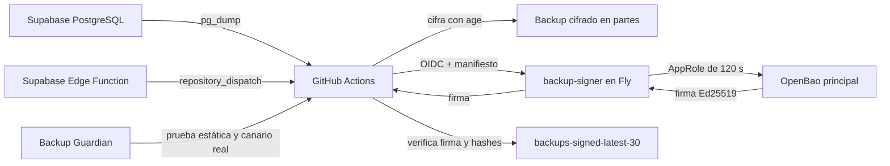
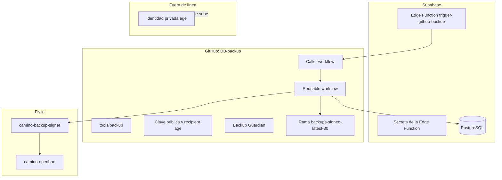
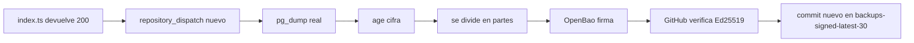
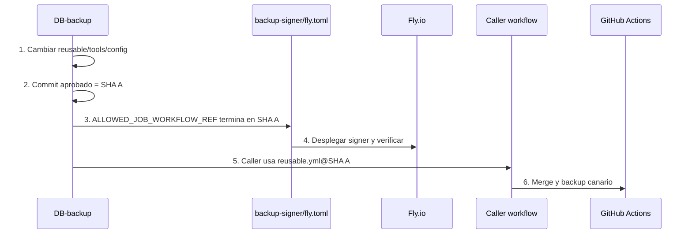

# GUÍA COMPLETA DEL BACKUP DESDE CERO

# Arquitectura del backup

## La historia corta

Imagina que la base de datos es un cofre con información importante:

- **Supabase Edge Function** es el timbre que dice: “empieza el backup”.
- **GitHub Actions** es el camión que recoge una copia.
- **age** mete la copia en una caja cerrada.
- **backup-signer** lleva el papel del contenido al notario.
- **OpenBao Transit** pone una firma que no se puede falsificar.
- **GitHub**, en la rama `backups-signed-latest-30`, guarda las últimas 30 cajas.
- **Backup Guardian** revisa que todo siga funcionando cuando cambiamos archivos.



## Dónde vive cada cosa



## Regla de oro

La identidad privada de `age`, el token raíz de OpenBao, `SUPABASE_DB_URL`, el PAT de GitHub y los secretos AppRole **nunca** se guardan en Git ni en esta documentación.


---

# Mapa de archivos: qué va en cada sitio

## Repositorio `StJames-way/DB-backup`

```text
DB-backup/
├── .github/
│   └── workflows/
│       ├── supabase-backup-dispatch.yml
│       ├── supabase-age-openbao-reusable.yml
│       └── backup-guardian.yml
├── config/
│   ├── age-recipient.txt
│   └── backup-signing-public-key.pem
├── tools/
│   └── backup/
│       ├── build_manifest.py
│       ├── verify_backup_set.py
│       ├── verify_signature.py
│       ├── restore_backup.py
│       ├── verify_plaintext_dump.py
│       └── requirements.txt
├── scripts/
├── restore_age_backup_complete.sh
└── docs/
    ├── README.md
    ├── instructions/
    ├── diagrams/
    ├── supabase/
    ├── mac-pc/
    ├── openbao/
    ├── backup-signer/
    └── checklists/
```

### Qué hace cada archivo importante

| Archivo | Trabajo |
|---|---|
| `.github/workflows/supabase-backup-dispatch.yml` | Es el botón de entrada de GitHub. Recibe `repository_dispatch` o ejecución manual y llama al reusable fijado a un SHA |
| `.github/workflows/supabase-age-openbao-reusable.yml` | Hace el dump, cifra, parte, firma, verifica, conserva 30 y publica |
| `.github/workflows/backup-guardian.yml` | Vigila cambios y ejecuta un backup canario real tras cambios importantes |
| `config/age-recipient.txt` | Contiene solo la clave pública `age1...` |
| `config/backup-signing-public-key.pem` | Clave pública Ed25519 de OpenBao para comprobar firmas |
| `tools/backup/*.py` | Construyen y verifican manifiestos, partes y firmas |
| `docs/supabase/index.ts` | Copia documentada del código de la Edge Function |
| `docs/supabase/config.toml.snippet` | Configura `verify_jwt = false` de forma reproducible |
| `docs/supabase/schedule.sql.example` | Plantilla del reloj `pg_cron` + `pg_net` usando Vault |
| `docs/mac-pc/backup-guardian-v4.yml` | Plantilla del Guardian que se instala en `.github/workflows/backup-guardian.yml` |

## Repositorio `StJames-way/backup-signer`

```text
backup-signer/
├── .github/workflows/ci.yml
├── app/
├── tests/
├── certs/camino-openbao-ca.pem
├── openbao/backup-signer-policy.hcl
├── Dockerfile
├── fly.toml
├── pyproject.toml
└── README.md
```

No necesita variables ni secretos en GitHub. Su CI construye y prueba, pero no despliega.

## Supabase

```text
Edge Function desplegada:
trigger-github-backup

Código documentado:
docs/supabase/index.ts

Ruta local de despliegue:
supabase/functions/trigger-github-backup/index.ts
```

## Mac o PC

Los scripts Bash se instalan en:

```text
$HOME/.local/bin/
```

En Windows se ejecutan dentro de **WSL2 con Ubuntu**. No se ejecutan directamente desde `cmd.exe`.


---

# Instalación desde cero, explicada paso a paso

> “Desde cero” significa construir el sistema de backup. No significa crear un segundo OpenBao. Se usa el OpenBao principal existente.

## Paso 0. Comprueba los nombres

```text
Repositorio de backups: StJames-way/DB-backup
Repositorio signer:      StJames-way/backup-signer
Supabase project ref:    urfbxknxmzcvgogkixdq
Edge Function:           trigger-github-backup
Fly signer:              camino-backup-signer
Fly OpenBao:             camino-openbao
Rama de código:          main
Rama de backups:         backups-signed-latest-30
```

## Paso 1. Instala las herramientas en Mac

Con Homebrew:

```bash
brew install \
  age \
  gh \
  flyctl \
  jq \
  openssl@3 \
  postgresql@17 \
  supabase/tap/supabase
```

Comprueba:

```bash
for TOOL in age gh fly jq openssl pg_dump pg_restore supabase; do
  command -v "$TOOL" >/dev/null || echo "FALTA: $TOOL"
done
```

Inicia sesión:

```bash
gh auth login
fly auth login
supabase login
```

### Windows

Instala WSL2 + Ubuntu y ejecuta los comandos Bash dentro de Ubuntu. Los scripts no están preparados para `cmd.exe`.

## Paso 2. Crea la llave `age`

La llave privada abre los backups. Debe estar offline.

```bash
umask 077
mkdir -p "$HOME/backup-recovery"

age-keygen \
  -o "$HOME/backup-recovery/supabase-backup-age-identity.txt"

age-keygen \
  -y "$HOME/backup-recovery/supabase-backup-age-identity.txt" \
  > config/age-recipient.txt

chmod 600 \
  "$HOME/backup-recovery/supabase-backup-age-identity.txt"
```

La privada:

```text
$HOME/backup-recovery/supabase-backup-age-identity.txt
```

no se sube jamás a GitHub, Supabase, Fly ni OpenBao.

La pública actual es:

```text
age18gt5e7d48tfyhx4552kc5wyp52lt5rf34ag0sat3t4xsrg0fqg8stagvae
```

## Paso 3. Prepara OpenBao

Usa el OpenBao principal. Los nombres aprobados son:

```text
AppRole mount:  approle-backup/
Role:           backup-signer-gateway
Policy:         backup-signer-gateway
Transit mount:  transit-backup/
Transit key:    supabase-backup-manifest
Tipo de clave:  ed25519
```

Policy mínima:

```hcl
path "transit-backup/sign/supabase-backup-manifest" {
  capabilities = ["update"]
}
```

Crea la clave Transit si todavía no existe:

```bash
bao secrets enable -path=transit-backup transit || true

bao write \
  transit-backup/keys/supabase-backup-manifest \
  type=ed25519 \
  exportable=false \
  allow_plaintext_backup=false
```

Crea la policy:

```bash
cat > /tmp/backup-signer-gateway.hcl <<'EOF'
path "transit-backup/sign/supabase-backup-manifest" {
  capabilities = ["update"]
}
EOF

bao policy write \
  backup-signer-gateway \
  /tmp/backup-signer-gateway.hcl

rm -f /tmp/backup-signer-gateway.hcl
```

Asegúrate de que el mount AppRole dedicado existe:

```bash
bao auth enable -path=approle-backup approle || true
```

Crea el role con token de un solo uso y 120 segundos:

```bash
bao write \
  auth/approle-backup/role/backup-signer-gateway \
  token_policies=backup-signer-gateway \
  token_no_default_policy=true \
  token_ttl=120s \
  token_max_ttl=120s \
  token_num_uses=1 \
  secret_id_num_uses=0 \
  local_secret_ids=true
```

Obtén RoleID y SecretID sin mostrarlos:

```bash
set +x
umask 077

ROLE_ID="$(
  bao read -field=role_id \
    auth/approle-backup/role/backup-signer-gateway/role-id
)"

SECRET_ID="$(
  bao write -field=secret_id -f \
    auth/approle-backup/role/backup-signer-gateway/secret-id
)"

test -n "$ROLE_ID"
test -n "$SECRET_ID"
```

## Paso 4. Exporta la clave pública de firma

```bash
bao read -format=json \
  transit-backup/keys/supabase-backup-manifest |
jq -r '.data.keys[(.data.latest_version|tostring)].public_key' \
  > config/backup-signing-public-key.pem
```

Comprueba la huella:

```bash
openssl pkey \
  -pubin \
  -in config/backup-signing-public-key.pem \
  -outform DER |
shasum -a 256
```

Valor actual:

```text
4011dd69e227bfcf6f39b3f44b1ad499d2a582c9f3eed93d8896e61b7485ce96
```

## Paso 5. Prepara `backup-signer`

El repositorio lleva:

```text
app/
tests/
certs/camino-openbao-ca.pem
openbao/backup-signer-policy.hcl
Dockerfile
fly.toml
pyproject.toml
.github/workflows/ci.yml
```

Copia también la CA pública del OpenBao principal a:

```text
certs/camino-openbao-ca.pem
```

Es material público: sirve para comprobar el certificado TLS interno. No copies una clave privada de la CA.

Obtén los IDs públicos de GitHub:

```bash
gh api \
  repos/StJames-way/DB-backup \
  --jq '"REPOSITORY_ID=\(.id)\nOWNER_ID=\(.owner.id)"'
```

En `fly.toml`, los datos no secretos deben incluir:

```toml
GITHUB_OIDC_ISSUER = "https://token.actions.githubusercontent.com"
GITHUB_OIDC_AUDIENCE = "openbao://supabase-backup-signing"
ALLOWED_REPOSITORY = "StJames-way/DB-backup"
ALLOWED_REPOSITORY_ID = "REPO_ID_NUMERICO"
ALLOWED_REPOSITORY_OWNER_ID = "OWNER_ID_NUMERICO"
ALLOWED_REF = "refs/heads/main"
ALLOWED_JOB_WORKFLOW_REF = "StJames-way/DB-backup/.github/workflows/supabase-age-openbao-reusable.yml@9df9f393517fffddca9e4bb7264211010cb0912b"
ALLOWED_CALLER_WORKFLOW_REF = "StJames-way/DB-backup/.github/workflows/supabase-backup-dispatch.yml@refs/heads/main"
ALLOWED_EVENTS = "workflow_dispatch,repository_dispatch"
OPENBAO_ADDR = "https://camino-openbao.internal:8200"
OPENBAO_CA_FILE = "/etc/ssl/certs/camino-openbao-ca.pem"
OPENBAO_AUTH_MOUNT = "approle-backup"
OPENBAO_TRANSIT_MOUNT = "transit-backup"
OPENBAO_KEY_NAME = "supabase-backup-manifest"
```

Los únicos dos Fly secrets son:

```bash
fly secrets set \
  --app camino-backup-signer \
  OPENBAO_ROLE_ID="$ROLE_ID" \
  OPENBAO_SECRET_ID="$SECRET_ID"
```

Limpia las variables locales al terminar:

```bash
unset ROLE_ID SECRET_ID
```

## Paso 6. Crea los archivos de `DB-backup`

Coloca:

```text
.github/workflows/supabase-backup-dispatch.yml
.github/workflows/supabase-age-openbao-reusable.yml
config/age-recipient.txt
config/backup-signing-public-key.pem
tools/backup/*.py
```

En el caller, el reusable debe estar fijado a un SHA completo:

```yaml
uses: StJames-way/DB-backup/.github/workflows/supabase-age-openbao-reusable.yml@9df9f393517fffddca9e4bb7264211010cb0912b
```

Nunca uses:

```yaml
@main
@master
@v1
```

## Paso 7. Crea las variables públicas de GitHub

Desde el repo local `DB-backup`:

```bash
bash docs/mac-pc/set-github-public-variables.sh
```

El script crea todas las variables que aparecen en la tabla. Recuerda que solo `BACKUP_AGE_RECIPIENT` y `BACKUP_SIGNER_URL` gobiernan directamente el workflow actual.

## Paso 8. Crea el secreto GitHub `SUPABASE_DB_URL`

En la web:

```text
DB-backup
→ Settings
→ Secrets and variables
→ Actions
→ Secrets
→ New repository secret
```

Nombre:

```text
SUPABASE_DB_URL
```

Valor: URI PostgreSQL de Supabase. No se pega en el chat ni se escribe en documentación.

## Paso 9. Instala la Edge Function de Supabase

Copia el archivo documentado a la ruta de despliegue:

```bash
mkdir -p \
  supabase/functions/trigger-github-backup

install -m 0644 \
  docs/supabase/index.ts \
  supabase/functions/trigger-github-backup/index.ts
```

Declara también esta configuración en `supabase/config.toml` para que no dependa solo del comando manual:

```toml
[functions.trigger-github-backup]
verify_jwt = false
```

Despliega con autenticación propia:

```bash
supabase functions deploy \
  trigger-github-backup \
  --project-ref urfbxknxmzcvgogkixdq \
  --no-verify-jwt
```

Secrets requeridos en Supabase:

```text
BACKUP_TRIGGER_SECRET
GITHUB_TOKEN
GITHUB_BACKUP_REPO
GITHUB_BACKUP_EVENT_TYPE
BACKUP_AGE_RECIPIENT
BACKUP_DISPATCH_SOURCE
BACKUP_POLICY
BACKUP_FORMAT_VERSION
BACKUP_TIMEZONE
BACKUP_SCHEDULE_HOUR
```

Valores públicos exactos:

```text
GITHUB_BACKUP_REPO=StJames-way/DB-backup
GITHUB_BACKUP_EVENT_TYPE=supabase_backup_trigger
BACKUP_AGE_RECIPIENT=age18gt5e7d48tfyhx4552kc5wyp52lt5rf34ag0sat3t4xsrg0fqg8stagvae
BACKUP_DISPATCH_SOURCE=supabase-edge-function
BACKUP_POLICY=daily_full_age_encrypted_openbao_signed_retain_last_30_verified
BACKUP_FORMAT_VERSION=5
BACKUP_TIMEZONE=Europe/Madrid
BACKUP_SCHEDULE_HOUR=02  # ejemplo; elige una hora real entre 00 y 23
```

Los dos secretos propios de la Edge Function son:

```text
BACKUP_TRIGGER_SECRET: aleatorio de 32 bytes
GITHUB_TOKEN: PAT fine-grained limitado a DB-backup con Contents write
```

`SUPABASE_DB_URL` no pertenece a esta Edge Function. Vive únicamente como GitHub Secret en `DB-backup`.

Genera el trigger secret:

```bash
umask 077
openssl rand -hex 32
```

No lo muestres ni lo guardes en Git.

### Paso 9B. Crea el reloj automático

La Edge Function no se despierta sola. Necesita un reloj que la llame. Supabase permite hacerlo con `pg_cron` + `pg_net` y recomienda guardar el secreto de llamada en Vault.

Activa las extensiones desde SQL Editor si aún no están activas:

```sql
create extension if not exists pg_cron;
create extension if not exists pg_net;
```

Guarda en Vault la URL del proyecto y el mismo `BACKUP_TRIGGER_SECRET` que tiene la Edge Function:

```sql
select vault.create_secret(
  'https://urfbxknxmzcvgogkixdq.supabase.co',
  'backup_project_url'
);

select vault.create_secret(
  'PEGA_AQUI_EL_BACKUP_TRIGGER_SECRET',
  'backup_trigger_secret'
);
```

Después crea un reloj que llame una vez por hora, en el minuto 5:

```sql
select cron.schedule(
  'trigger-github-backup-hourly',
  '5 * * * *',
  $$
  select net.http_post(
    url := (
      select decrypted_secret
      from vault.decrypted_secrets
      where name = 'backup_project_url'
    ) || '/functions/v1/trigger-github-backup',
    headers := jsonb_build_object(
      'Content-Type', 'application/json',
      'x-backup-trigger-secret', (
        select decrypted_secret
        from vault.decrypted_secrets
        where name = 'backup_trigger_secret'
      )
    ),
    body := '{}'::jsonb
  ) as request_id;
  $$
);
```

La llamada ocurre cada hora, pero `index.ts` solo dispara el backup cuando la hora local coincide con `BACKUP_SCHEDULE_HOUR`. La prueba manual usa `?force=1` y salta esa espera.

Reglas:

- El PAT `GITHUB_TOKEN` se queda en Supabase Edge Function Secrets.
- En Vault/SQL solo se guarda `BACKUP_TRIGGER_SECRET`, nunca el PAT de GitHub.
- Tras crear el cron, revisa `cron.job` y `cron.job_run_details`.

## Paso 10. Instala Backup Guardian

Dentro de `DB-backup`:

```bash
bash docs/mac-pc/install-backup-guardian.sh
```

Eso copia:

```text
docs/mac-pc/backup-guardian-v4.yml
```

hacia:

```text
.github/workflows/backup-guardian.yml
```

El YAML no se “instala en el Mac”. El Mac solo ejecuta el script que lo coloca en el repositorio. GitHub Actions es quien lo ejecuta.

## Paso 11. Instala las herramientas locales

```bash
bash docs/mac-pc/install-local-tools.sh
```

Quedarán en:

```text
$HOME/.local/bin/deploy-backup-signer
$HOME/.local/bin/verify-backup-signer-deployment
$HOME/.local/bin/deploy-backup-signer-and-verify
$HOME/.local/bin/test-supabase-backup-e2e
```

## Paso 12. Despliega y prueba

Signer:

```bash
unset FLY_API_TOKEN

"$HOME/.local/bin/deploy-backup-signer-and-verify" \
  9df9f393517fffddca9e4bb7264211010cb0912b
```

Cadena desde Supabase:

```bash
export SUPABASE_PROJECT_REF="urfbxknxmzcvgogkixdq"
export SUPABASE_FUNCTION_NAME="trigger-github-backup"

"$HOME/.local/bin/test-supabase-backup-e2e"
```

## Paso 13. Qué significa “todo verde”



## Paso 14. El backup solo queda certificado tras restaurar

Un backup firmado demuestra integridad. Una restauración aislada demuestra recuperabilidad.

La identidad privada `age` solo se usa localmente durante el simulacro de recuperación. Nunca se sube.


---

# Variables de GitHub de `StJames-way/DB-backup`

## La diferencia entre variable y secreto

- Una **variable** contiene información pública o de configuración.
- Un **secreto** contiene algo que permite entrar o hacer daño si se roba.

En `DB-backup`, el único secreto que necesita el workflow es:

```text
SUPABASE_DB_URL
```

No se escribe en ningún archivo. Se guarda en:

```text
DB-backup → Settings → Secrets and variables → Actions → Secrets
```

## Tabla completa de las variables que tienes ahora

| Variable | Valor actual | De dónde sale | ¿La lee hoy el workflow? | Qué pasa si la cambias solo en GitHub |
|---|---|---|---|---|
| `BACKUP_AGE_RECIPIENT` | `age18gt5e7d48tfyhx4552kc5wyp52lt5rf34ag0sat3t4xsrg0fqg8stagvae` | Es la parte pública obtenida con `age-keygen -y` desde la identidad privada offline | **Sí**. El caller la pasa al reusable | Cambia el recipient que intenta usar el workflow, pero fallará si no actualizas también la huella esperada y Supabase |
| `BACKUP_ALLOWED_REF` | `refs/heads/main` | Es la rama autorizada. Debe coincidir con `ALLOWED_REF` de `backup-signer/fly.toml` | **No** en los workflows actuales; es una copia de control | No cambia el comportamiento real |
| `BACKUP_DISPATCH_SOURCE` | `supabase-edge-function` | Es el nombre que envía `docs/supabase/index.ts` en el payload | **No** como variable de repo; el valor llega en el payload y se valida en el reusable | No cambia el comportamiento real |
| `BACKUP_FORMAT_VERSION` | `5` | Es la versión del contrato del manifiesto y del payload | **No** como variable de repo; está validada en Edge Function, caller y reusable | No cambia el comportamiento real |
| `BACKUP_PART_SIZE_BYTES` | `94371840` | `90 × 1024 × 1024`; son 90 MiB | **No**; el reusable usa actualmente `split --bytes=90M` | No cambia el tamaño real |
| `BACKUP_POLICY` | `daily_full_age_encrypted_openbao_signed_retain_last_30_verified` | Es el nombre exacto de la política que acuerdan Supabase y GitHub | **No** como variable de repo; está en el payload y en las validaciones | No cambia el comportamiento real |
| `BACKUP_RETENTION_COUNT` | `30` | Decisión de conservar los 30 backups verificados más nuevos | **No**; el reusable tiene `30` en su código | No cambia la retención real |
| `BACKUP_SIGNER_URL` | `https://camino-backup-signer.fly.dev` | Es la URL pública de la app Fly `camino-backup-signer` | **Sí**. El caller la pasa al reusable | El reusable solo aceptará la URL aprobada; si difiere, fallará |
| `BACKUP_SIGNING_PUBLIC_KEY_SHA256` | `4011dd69e227bfcf6f39b3f44b1ad499d2a582c9f3eed93d8896e61b7485ce96` | SHA-256 del DER de `config/backup-signing-public-key.pem` | **No** como variable de repo; la huella está fijada en el reusable y Guardian | No cambia la clave que realmente se acepta |
| `BACKUP_STORAGE_BRANCH` | `backups-signed-latest-30` | Nombre elegido para la rama que guarda las cajas cifradas | **No**; está fijada en reusable, Guardian y pruebas | No cambia la rama real |
| `BACKUP_TIMEOUT_MINUTES` | `120` | Tiempo máximo permitido al job de backup | **No**; `timeout-minutes: 120` está en el reusable | No cambia el timeout real |
| `BACKUP_TIMEZONE` | `Europe/Madrid` | Zona usada para decidir el día y la hora del backup | **No** en GitHub; reusable y Edge Function tienen su propia configuración | No cambia la hora real |
| `EXPECTED_AGE_RECIPIENT_SHA256` | `f59fd599322f109270cfa7fd614e38b8eb7d5ca823c0443f8f0d55651e4b31aa` | SHA-256 exacto de `BACKUP_AGE_RECIPIENT`, sin salto de línea | **No** como variable; está fijada en reusable y Guardian | No cambia la huella que se valida |
| `OPENBAO_OIDC_AUDIENCE` | `openbao://supabase-backup-signing` | Texto acordado entre GitHub Actions y el signer para el token OIDC | **No** como variable; está fijado en reusable y `fly.toml` | No cambia la audiencia real |

## Aviso importante

Solo estas dos variables gobiernan directamente el workflow actual:

```text
BACKUP_AGE_RECIPIENT
BACKUP_SIGNER_URL
```

Las demás son **copias visibles del contrato**. Son útiles para saber cuál debe ser el valor, pero cambiarlas solas no modifica el código. La matriz de cambios explica todos los sitios que hay que actualizar.

## Cómo calcular la huella del recipient age

En macOS:

```bash
RECIPIENT="$(tr -d '\r\n' < config/age-recipient.txt)"
printf '%s' "$RECIPIENT" | shasum -a 256
```

En Linux o WSL:

```bash
RECIPIENT="$(tr -d '\r\n' < config/age-recipient.txt)"
printf '%s' "$RECIPIENT" | sha256sum
```

Resultado actual esperado:

```text
f59fd599322f109270cfa7fd614e38b8eb7d5ca823c0443f8f0d55651e4b31aa
```

## Cómo calcular la huella de la clave pública Ed25519

macOS:

```bash
openssl pkey \
  -pubin \
  -in config/backup-signing-public-key.pem \
  -outform DER |
shasum -a 256
```

Linux o WSL:

```bash
openssl pkey \
  -pubin \
  -in config/backup-signing-public-key.pem \
  -outform DER |
sha256sum
```

Resultado actual esperado:

```text
4011dd69e227bfcf6f39b3f44b1ad499d2a582c9f3eed93d8896e61b7485ce96
```


---

# Matriz de cambios: “toqué esto, ¿qué más debo tocar?”

Esta es la página más importante después de la instalación.

## Primero: hay dos SHA distintos

```text
SHA del reusable aprobado
≠
SHA del último commit del caller
```

El signer mira el **SHA del reusable**, porque ese es el código que realmente hace el backup.

El valor actual aprobado es:

```text
9df9f393517fffddca9e4bb7264211010cb0912b
```

## Cómo actualizar el SHA sin crear un círculo imposible



El commit que actualiza el caller puede ser un commit posterior, llamado SHA B. Eso es normal. El caller de SHA B puede apuntar al reusable aprobado de SHA A.

## Tabla de cambios

| Cambias | También debes actualizar | Después ejecuta |
|---|---|---|
| Solo documentación en `docs/` | Nada criptográfico | Guardian; el push a `main` lanza canario porque `docs/**` está vigilado |
| `backup-guardian.yml` | Copia `docs/mac-pc/backup-guardian-v4.yml` y `.github/workflows/backup-guardian.yml` | PR, Guardian estático y luego canario |
| `docs/supabase/index.ts` | Copia operativa `supabase/functions/trigger-github-backup/index.ts` y despliega Edge Function | `test-supabase-backup-e2e-v2` |
| Caller `supabase-backup-dispatch.yml` sin cambiar el SHA del reusable | Normalmente nada en signer | Guardian y canario |
| Reusable, `tools/backup/*` o los activos que el reusable carga por SHA | Nuevo SHA aprobado; `ALLOWED_JOB_WORKFLOW_REF` de `backup-signer/fly.toml`; desplegar signer; después cambiar el caller al mismo SHA | CI signer, despliegue local, Guardian y canario |
| `config/age-recipient.txt` | `BACKUP_AGE_RECIPIENT` GitHub; `BACKUP_AGE_RECIPIENT` Supabase; huella `f59fd599322f109270cfa7fd614e38b8eb7d5ca823c0443f8f0d55651e4b31aa` en reusable y Guardian; variable espejo `EXPECTED_AGE_RECIPIENT_SHA256` | E2E desde Edge Function y conservar la identidad privada antigua |
| Clave Transit o `backup-signing-public-key.pem` | Exportar nueva pública; recalcular DER SHA; actualizar reusable, Guardian y variable espejo `BACKUP_SIGNING_PUBLIC_KEY_SHA256` | Canario y prueba de restauración; conservar claves públicas antiguas |
| URL del signer | `BACKUP_SIGNER_URL` GitHub; URL esperada en reusable; valor esperado del Guardian | Desplegar signer y canario |
| Audiencia OIDC | Reusable; `GITHUB_OIDC_AUDIENCE` en signer `fly.toml`; Guardian; variable espejo `OPENBAO_OIDC_AUDIENCE` | Desplegar signer y canario |
| Rama autorizada | Checks del reusable; `ALLOWED_REF` y caller ref del signer; ruleset; variable espejo `BACKUP_ALLOWED_REF` | Desplegar signer y canario |
| Política, origen o versión de formato | Edge Function y sus secrets; caller; reusable; Guardian; variables espejo | E2E desde Edge Function |
| Tamaño de parte | `split --bytes=...` en reusable; variable espejo `BACKUP_PART_SIZE_BYTES`; documentación | Nuevo SHA, actualizar signer/caller y canario |
| Retención | Código “newest 30” del reusable; nombre de política si cambia; variable espejo `BACKUP_RETENTION_COUNT`; documentación | Nuevo SHA y canario |
| Rama de almacenamiento | Reusable, Guardian, pruebas E2E y variable espejo `BACKUP_STORAGE_BRANCH` | Nuevo SHA y canario; no incluir esa rama en ruleset de `main` |
| Timeout | `timeout-minutes` del reusable, Guardian si corresponde y variable espejo `BACKUP_TIMEOUT_MINUTES` | Nuevo SHA y canario |
| Zona horaria | Edge Function, reusable y variable espejo `BACKUP_TIMEZONE` | E2E desde Edge Function |
| Código de `backup-signer` | No cambia el reusable SHA por sí solo | CI signer, despliegue desde Mac/WSL y canario |
| `ALLOWED_JOB_WORKFLOW_REF` | Debe terminar exactamente en el SHA aprobado del reusable | Desplegar signer antes de activar el caller nuevo |
| AppRole RoleID/SecretID | Solo Fly secrets `OPENBAO_ROLE_ID` y `OPENBAO_SECRET_ID` | Desplegar/reiniciar signer y ejecutar verificador |
| `SUPABASE_DB_URL` | Solo GitHub Secret del repo `DB-backup` | Backup manual/canario; no escribirla en archivos |
| PAT de GitHub usado por Edge Function | Solo secret Supabase `GITHUB_TOKEN` | E2E desde Edge Function |
| `BACKUP_TRIGGER_SECRET` | Secret de la Edge Function y secreto `backup_trigger_secret` de Supabase Vault | E2E desde Edge Function y comprobar el cron |

## Cosas que nunca se actualizan juntas “a ciegas”

1. No cambies el caller a un SHA nuevo antes de que el signer lo autorice.
2. No borres la identidad privada `age` antigua al rotar recipient.
3. No reemplaces la clave pública vieja si aún necesitas verificar backups históricos; archívala por versión.
4. No guardes `FLY_API_TOKEN` en GitHub.
5. No crees otro OpenBao para este backup: usa el OpenBao principal con permisos `sign-only`.


---

# Cómo demostrar que funciona

## Prueba 1: Guardian estático

Debe poner verde:

```text
Guardian / static contract
```

Comprueba sintaxis, archivos generados, claves privadas, SHA inmutables, contrato, huellas y tests deterministas.

## Prueba 2: canario real

Debe poner verde:

```text
Guardian / production canary
```

Hace un backup real, no un dry-run.

## Prueba 3: extremo a extremo desde Supabase

```bash
export SUPABASE_PROJECT_REF="urfbxknxmzcvgogkixdq"
export SUPABASE_FUNCTION_NAME="trigger-github-backup"

"$HOME/.local/bin/test-supabase-backup-e2e"
```

Resultado esperado:

```text
PRUEBA E2E DESDE index.ts: CORRECTA
```


## Protección de `main` con el plan actual

En una organización con repositorio privado y GitHub Free, el ruleset puede quedar configurado pero no aplicado. No hagas público `DB-backup` para resolverlo. Hasta contratar GitHub Team, la regla humana es sencilla: **no fusiones ningún PR con Guardian rojo**, aunque el botón de merge siga disponible.

La rama `backups-signed-latest-30` no debe incluirse en el ruleset de `main`, porque el workflow la actualiza directamente.

## Prueba 4: restauración

1. descargar manifiesto, firma y partes;
2. verificar tamaños y SHA-256;
3. verificar Ed25519;
4. unir partes;
5. descifrar con identidad `age` offline;
6. comparar SHA del dump plano;
7. ejecutar `pg_restore --list`;
8. restaurar en un proyecto Supabase aislado y desechable.

Sin este último paso, el backup está íntegro, pero todavía no está demostrado que sea recuperable.


---

# Simulacro de recuperación

## Regla de seguridad

Nunca restaures primero sobre producción.


## Qué no restaura un `pg_dump` por sí solo

- Edge Functions desplegadas.
- Secrets de Edge Functions.
- API keys.
- Configuración externa de Auth/OAuth.
- Objetos de Storage.
- Configuración de Fly/OpenBao/GitHub.

Por eso este repositorio guarda además documentación y contratos de instalación.


---

# Checklist antes de considerar el sistema terminado

- [ ] `SUPABASE_DB_URL` está solo en GitHub Secret.
- [ ] La identidad privada `age` está offline y hay una copia de recuperación segura.
- [ ] `config/age-recipient.txt` contiene solo la pública.
- [ ] La huella age es `f59fd599322f109270cfa7fd614e38b8eb7d5ca823c0443f8f0d55651e4b31aa`.
- [ ] La huella pública Ed25519 es `4011dd69e227bfcf6f39b3f44b1ad499d2a582c9f3eed93d8896e61b7485ce96`.
- [ ] Caller y signer usan el mismo SHA reusable `9df9f393517fffddca9e4bb7264211010cb0912b`.
- [ ] `backup-signer` tiene exactamente dos Fly Secrets.
- [ ] `/healthz` devuelve `ok`.
- [ ] `/readyz` devuelve `ready`.
- [ ] `Guardian / static contract` está verde.
- [ ] `Guardian / production canary` está verde.
- [ ] E2E desde `trigger-github-backup` está verde.
- [ ] Existe un commit nuevo en `backups-signed-latest-30`.
- [ ] Existe manifiesto, firma y todas las partes.
- [ ] Se realizó una restauración aislada.
