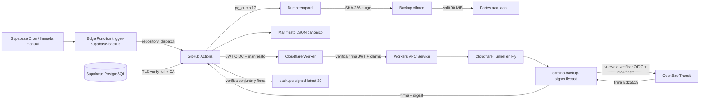
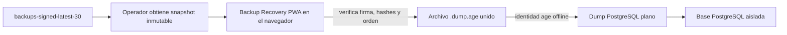

# Arquitectura del backup firmado con verificación OIDC en Cloudflare

## Resumen

El sistema crea un dump completo de PostgreSQL, verifica el canal TLS de
Supabase, cifra el dump con `age`, construye un manifiesto determinista, exige
una identidad OIDC emitida por GitHub, valida esa identidad en **dos capas**,
firma el manifiesto con una clave Ed25519 no exportable en OpenBao Transit y
publica un snapshot de almacenamiento en una rama separada.

La barrera añadida en la arquitectura actual es **Cloudflare Backup Gateway**:
el Worker comprueba criptográficamente el JWT OIDC de GitHub antes de permitir
que la petición llegue al signer privado. El signer vuelve a validar el OIDC y
la procedencia del manifiesto. Ninguna de esas dos capas sustituye a la otra.

## Flujo de datos



## Dos rutas distintas

### Ruta del contenido de la base

```text
Supabase PostgreSQL
  -> TLS PostgreSQL verify-full
  -> runner efímero de GitHub
  -> dump plano temporal
  -> cifrado age
  -> partes cifradas en la rama de backups
```

El dump plano existe durante la ejecución dentro del runner efímero. Se elimina
al finalizar, tanto si el job termina bien como si falla. Cloudflare, Fly y
OpenBao **no reciben el dump**.

### Ruta de la firma

```text
GitHub OIDC + manifiesto
  -> Cloudflare Worker
  -> Workers VPC Service
  -> Cloudflare Tunnel
  -> Flycast privado
  -> backup-signer
  -> OpenBao Transit
```

Solo el manifiesto y la identidad OIDC atraviesan esa ruta. OpenBao firma los
bytes canónicos del manifiesto, no el archivo cifrado ni el dump plano.

## Capas de autorización

### 1. Workflow inmutable

El caller usa el reusable fijado a un SHA completo:

```text
9c1562857b371396e478fe078dd1ace772a93abc
```

No debe utilizar `@main`, una rama móvil ni un tag movible.

### 2. OIDC solicitado por GitHub

El runner solicita un token para la audiencia:

```text
openbao://supabase-backup-signing
```

El propio workflow inspecciona los claims básicos antes de enviar la petición.

### 3. Cloudflare Worker: primera verificación criptográfica

El Worker:

- exige `Bearer <JWT>`;
- limita tamaño del JWT y del cuerpo;
- descarga las claves JWKS oficiales de GitHub;
- verifica la firma `RS256` con Web Crypto;
- valida `iss`, `aud`, `exp`, `nbf`, `iat` y `jti`;
- valida repositorio, IDs inmutables, rama, evento y runner;
- valida caller workflow, reusable workflow y SHA aprobado;
- aplica rate limits por IP, token, origen y readiness;
- falla cerrado si no puede verificar el JWT;
- cachea JWKS y reintenta fallos temporales antes de devolver `503`.

Configuración de resiliencia actualmente desplegada:

```text
Intentos JWKS:            6
Timeout por intento:      15 segundos
Backoff base:             500 ms exponencial
Caché JWKS correcta:      300 segundos
Errores 4xx/5xx:          no cacheados
```

### 4. Token Worker -> signer

El Worker añade `X-Backup-Gateway-Token`. El signer lo compara en tiempo
constante antes de que FastAPI/Pydantic procese el manifiesto. El token solo
debe existir como secreto en Cloudflare y Fly.

### 5. Signer: segunda verificación OIDC

El signer vuelve a verificar el token de GitHub y coteja la procedencia del
manifiesto:

- `repository`;
- `workflow_sha`;
- `run_id`;
- `run_attempt`;
- caller y reusable permitidos;
- `ref == refs/heads/main`;
- evento permitido;
- runner alojado por GitHub.

### 6. OpenBao de mínimo privilegio

El signer obtiene un token AppRole temporal y de un solo uso. Su policy solo
permite:

```text
update transit-backup/sign/supabase-backup-manifest
```

La clave Ed25519 es no exportable y no permite descifrado ni administración.

## Supabase y TLS

El workflow usa:

```text
PGSSLMODE=verify-full
PGSSLROOTCERT=/tmp/backup-trusted/prod-ca-2021.crt
```

También exige que `SUPABASE_DB_URL` contenga exactamente una vez:

```text
sslmode=verify-full
```

La CA aprobada se valida por su huella DER SHA-256:

```text
807025ad50d4ed219d2c9c7d299c004f824eb00cf7f65afef607d07b72e6cafa
```

El usuario del pooler debe seguir el formato:

```text
backup_reader.<PROJECT_REF>
```

El rol actual tiene permisos de lectura, `BYPASSRLS`, límite de 10 conexiones y
timeouts para sesiones abandonadas. `BYPASSRLS` es deliberado para que el dump
sea completo; por eso el rol no debe recibir permisos de escritura.

## Canonicalización firmada

La firma se realiza sobre:

```python
json.dumps(
    manifest,
    sort_keys=True,
    separators=(",", ":"),
    ensure_ascii=False,
).encode("utf-8")
```

No se firma el cuerpo HTTP original ni un JSON con espacios arbitrarios.

## Estructura del snapshot

```text
encrypted_backups/
  database_backup_2026-08-04_06-53-27.dump.age.aaa.part
  database_backup_2026-08-04_06-53-27.dump.age.aab.part

manifests/
  database_backup_2026-08-04_06-53-27.json

signatures/
  database_backup_2026-08-04_06-53-27.sig
  database_backup_2026-08-04_06-53-27.json
```

Los dos JSON no colisionan porque sus rutas completas son distintas. El JSON de
`manifests/` describe el backup; el JSON de `signatures/` describe la firma.

Los sufijos `aaa`, `aab`, `aac` son el comportamiento esperado de GNU `split`
cuando se usa `--suffix-length=3` sin sufijos numéricos.

## Retención y publicación

La rama de almacenamiento es:

```text
backups-signed-latest-30
```

El workflow conserva los 30 manifiestos más recientes y elimina de forma
coordinada manifiesto, firma, metadatos y partes de los backups más antiguos.
La publicación se realiza como snapshot de un solo commit y con control de
concurrencia para evitar dos escritores simultáneos.

## Escala a cero

El signer debe conservar:

```toml
auto_stop_machines = "stop"
auto_start_machines = true
min_machines_running = 0
```

Una llamada protegida a `/readyz` debe despertar el signer mediante Flycast.
No es necesario mantener una máquina permanentemente encendida.

## Plano de recuperación: PWA local

La creación/firma y la recuperación son planos distintos. La interfaz pública
de recuperación es:

- Aplicación: [https://stjames-way.github.io/backup-recovery-pwa/](https://stjames-way.github.io/backup-recovery-pwa/)
- Código: [https://github.com/StJames-way/backup-recovery-pwa](https://github.com/StJames-way/backup-recovery-pwa)



La PWA recibe únicamente archivos públicos/cifrados elegidos por el operador.
El procesamiento se realiza localmente y no se suben partes a GitHub Pages. La
PWA no conoce la identidad privada `age`, no descifra y no restaura PostgreSQL.

Esta herramienta verifica el conjunto y reduce errores manuales, pero la prueba
de recuperabilidad termina únicamente después de `pg_restore` en una base
aislada. Debe existir además un camino CLI/offline por si GitHub Pages no está
disponible.

## Límites de confianza

- GitHub Actions conoce `SUPABASE_DB_URL` y procesa temporalmente el dump plano.
- La identidad privada `age` no está en GitHub, Cloudflare, Fly ni OpenBao.
- Cloudflare ve el JWT OIDC y el manifiesto, nunca el dump.
- El signer ve el JWT y el manifiesto, nunca la URL de Supabase ni el dump.
- OpenBao recibe exclusivamente los bytes canónicos a firmar.
- GitHub almacena únicamente material cifrado y metadatos públicos.
- El token Worker -> signer no autoriza por sí solo: todavía se exige OIDC.

## Endpoints

| Endpoint | Exposición | Finalidad |
|---|---|---|
| Worker `GET /healthz` | pública | vida básica del Worker |
| Worker `GET /readyz` | protegida | prueba profunda Worker -> signer -> OpenBao |
| Worker `POST /v1/sign` | OIDC | única entrada operativa de firma |
| Signer `GET /readyz` | ruta privada | salud de OpenBao sin consumir AppRole |
| Signer `POST /v1/sign` | token gateway + OIDC | firma del manifiesto |

## Estado de privacidad de red

La ruta operativa validada usa VPC Service, Tunnel y Flycast. No obstante, una
instalación solo puede declararse **sin entrada pública directa** después de
comprobar `fly ips list -a <signer>` y retirar todas las IP de tipo `public`.
El hecho de usar Flycast no elimina automáticamente IP públicas antiguas.
