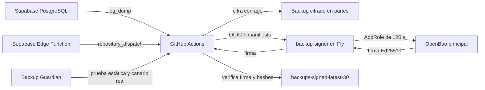
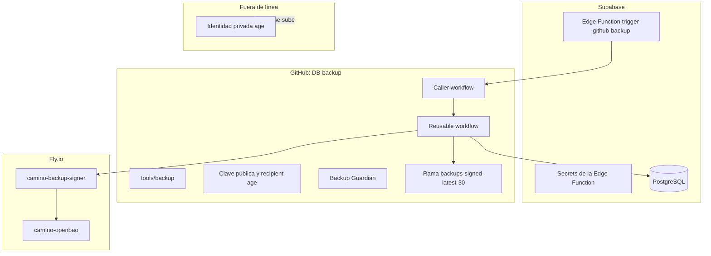

# Arquitectura del backup

## La historia corta

Imagina que la base de datos es un cofre con información importante:

- **Supabase Edge Function** es el timbre que dice: “empieza el backup”.
- **GitHub Actions** es el camión que recoge una copia.
- **age** mete la copia en una caja cerrada.
- **backup-signer** lleva el papel del contenido al notario.
- **OpenBao Transit** pone una firma que no se puede falsificar.
- **GitHub**, en la rama `backups-signed-latest-30`, guarda las últimas 30 cajas.
- **Backup Guardian** revisa que todo siga funcionando cuando cambiamos archivos.

## Dónde vive cada cosa

## Regla de oro

La identidad privada de `age`, el token raíz de OpenBao, `SUPABASE_DB_URL`, el PAT de GitHub y los secretos AppRole **nunca** se guardan en Git ni en esta documentación.
