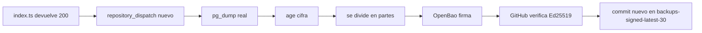

# Instalación desde cero, explicada paso a paso

> “Desde cero” significa construir el sistema de backup. No significa crear un segundo OpenBao. Se usa el OpenBao principal existente.

## Paso 0. Comprueba los nombres

```text
Repositorio de backups: StJames-way/DB-backup
Repositorio signer:      StJames-way/backup-signer
Supabase project ref:    urfbxknxmzcvgogkixdq
Edge Function:           trigger-github-backup
Fly signer:              camino-backup-signer
Fly OpenBao:             camino-openbao
Rama de código:          main
Rama de backups:         backups-signed-latest-30
```

## Paso 1. Instala las herramientas en Mac

Con Homebrew:

```bash
brew install \
  age \
  gh \
  flyctl \
  jq \
  openssl@3 \
  postgresql@17 \
  supabase/tap/supabase
```

Comprueba:

```bash
for TOOL in age gh fly jq openssl pg_dump pg_restore supabase; do
  command -v "$TOOL" >/dev/null || echo "FALTA: $TOOL"
done
```

Inicia sesión:

```bash
gh auth login
fly auth login
supabase login
```

### Windows

Instala WSL2 + Ubuntu y ejecuta los comandos Bash dentro de Ubuntu. Los scripts no están preparados para `cmd.exe`.

## Paso 2. Crea la llave `age`

La llave privada abre los backups. Debe estar offline.

```bash
umask 077
mkdir -p "$HOME/backup-recovery"

age-keygen \
  -o "$HOME/backup-recovery/supabase-backup-age-identity.txt"

age-keygen \
  -y "$HOME/backup-recovery/supabase-backup-age-identity.txt" \
  > config/age-recipient.txt

chmod 600 \
  "$HOME/backup-recovery/supabase-backup-age-identity.txt"
```

La privada:

```text
$HOME/backup-recovery/supabase-backup-age-identity.txt
```

no se sube jamás a GitHub, Supabase, Fly ni OpenBao.

La pública actual es:

```text
age18gt5e7d48tfyhx4552kc5wyp52lt5rf34ag0sat3t4xsrg0fqg8stagvae
```

## Paso 3. Prepara OpenBao

Usa el OpenBao principal. Los nombres aprobados son:

```text
AppRole mount:  approle-backup/
Role:           backup-signer-gateway
Policy:         backup-signer-gateway
Transit mount:  transit-backup/
Transit key:    supabase-backup-manifest
Tipo de clave:  ed25519
```

Policy mínima:

```hcl
path "transit-backup/sign/supabase-backup-manifest" {
  capabilities = ["update"]
}
```

Crea la clave Transit si todavía no existe:

```bash
bao secrets enable -path=transit-backup transit || true

bao write \
  transit-backup/keys/supabase-backup-manifest \
  type=ed25519 \
  exportable=false \
  allow_plaintext_backup=false
```

Crea la policy:

```bash
cat > /tmp/backup-signer-gateway.hcl <<'EOF'
path "transit-backup/sign/supabase-backup-manifest" {
  capabilities = ["update"]
}
EOF

bao policy write \
  backup-signer-gateway \
  /tmp/backup-signer-gateway.hcl

rm -f /tmp/backup-signer-gateway.hcl
```

Asegúrate de que el mount AppRole dedicado existe:

```bash
bao auth enable -path=approle-backup approle || true
```

Crea el role con token de un solo uso y 120 segundos:

```bash
bao write \
  auth/approle-backup/role/backup-signer-gateway \
  token_policies=backup-signer-gateway \
  token_no_default_policy=true \
  token_ttl=120s \
  token_max_ttl=120s \
  token_num_uses=1 \
  secret_id_num_uses=0 \
  local_secret_ids=true
```

Obtén RoleID y SecretID sin mostrarlos:

```bash
set +x
umask 077

ROLE_ID="$(
  bao read -field=role_id \
    auth/approle-backup/role/backup-signer-gateway/role-id
)"

SECRET_ID="$(
  bao write -field=secret_id -f \
    auth/approle-backup/role/backup-signer-gateway/secret-id
)"

test -n "$ROLE_ID"
test -n "$SECRET_ID"
```

## Paso 4. Exporta la clave pública de firma

```bash
bao read -format=json \
  transit-backup/keys/supabase-backup-manifest |
jq -r '.data.keys[(.data.latest_version|tostring)].public_key' \
  > config/backup-signing-public-key.pem
```

Comprueba la huella:

```bash
openssl pkey \
  -pubin \
  -in config/backup-signing-public-key.pem \
  -outform DER |
shasum -a 256
```

Valor actual:

```text
4011dd69e227bfcf6f39b3f44b1ad499d2a582c9f3eed93d8896e61b7485ce96
```

## Paso 5. Prepara `backup-signer`

El repositorio lleva:

```text
app/
tests/
certs/camino-openbao-ca.pem
openbao/backup-signer-policy.hcl
Dockerfile
fly.toml
pyproject.toml
.github/workflows/ci.yml
```

Copia también la CA pública del OpenBao principal a:

```text
certs/camino-openbao-ca.pem
```

Es material público: sirve para comprobar el certificado TLS interno. No copies una clave privada de la CA.

Obtén los IDs públicos de GitHub:

```bash
gh api \
  repos/StJames-way/DB-backup \
  --jq '"REPOSITORY_ID=\(.id)\nOWNER_ID=\(.owner.id)"'
```

En `fly.toml`, los datos no secretos deben incluir:

```toml
GITHUB_OIDC_ISSUER = "https://token.actions.githubusercontent.com"
GITHUB_OIDC_AUDIENCE = "openbao://supabase-backup-signing"
ALLOWED_REPOSITORY = "StJames-way/DB-backup"
ALLOWED_REPOSITORY_ID = "REPO_ID_NUMERICO"
ALLOWED_REPOSITORY_OWNER_ID = "OWNER_ID_NUMERICO"
ALLOWED_REF = "refs/heads/main"
ALLOWED_JOB_WORKFLOW_REF = "StJames-way/DB-backup/.github/workflows/supabase-age-openbao-reusable.yml@9df9f393517fffddca9e4bb7264211010cb0912b"
ALLOWED_CALLER_WORKFLOW_REF = "StJames-way/DB-backup/.github/workflows/supabase-backup-dispatch.yml@refs/heads/main"
ALLOWED_EVENTS = "workflow_dispatch,repository_dispatch"
OPENBAO_ADDR = "https://camino-openbao.internal:8200"
OPENBAO_CA_FILE = "/etc/ssl/certs/camino-openbao-ca.pem"
OPENBAO_AUTH_MOUNT = "approle-backup"
OPENBAO_TRANSIT_MOUNT = "transit-backup"
OPENBAO_KEY_NAME = "supabase-backup-manifest"
```

Los únicos dos Fly secrets son:

```bash
fly secrets set \
  --app camino-backup-signer \
  OPENBAO_ROLE_ID="$ROLE_ID" \
  OPENBAO_SECRET_ID="$SECRET_ID"
```

Limpia las variables locales al terminar:

```bash
unset ROLE_ID SECRET_ID
```

## Paso 6. Crea los archivos de `DB-backup`

Coloca:

```text
.github/workflows/supabase-backup-dispatch.yml
.github/workflows/supabase-age-openbao-reusable.yml
config/age-recipient.txt
config/backup-signing-public-key.pem
tools/backup/*.py
```

En el caller, el reusable debe estar fijado a un SHA completo:

```yaml
uses: StJames-way/DB-backup/.github/workflows/supabase-age-openbao-reusable.yml@9df9f393517fffddca9e4bb7264211010cb0912b
```

Nunca uses:

```yaml
@main
@master
@v1
```

## Paso 7. Crea las variables públicas de GitHub

Desde el repo local `DB-backup`:

```bash
bash docs/mac-pc/set-github-public-variables.sh
```

El script crea todas las variables que aparecen en la tabla. Recuerda que solo `BACKUP_AGE_RECIPIENT` y `BACKUP_SIGNER_URL` gobiernan directamente el workflow actual.

## Paso 8. Crea el secreto GitHub `SUPABASE_DB_URL`

En la web:

```text
DB-backup
→ Settings
→ Secrets and variables
→ Actions
→ Secrets
→ New repository secret
```

Nombre:

```text
SUPABASE_DB_URL
```

Valor: URI PostgreSQL de Supabase. No se pega en el chat ni se escribe en documentación.

## Paso 9. Instala la Edge Function de Supabase

Copia el archivo documentado a la ruta de despliegue:

```bash
mkdir -p \
  supabase/functions/trigger-github-backup

install -m 0644 \
  docs/supabase/index.ts \
  supabase/functions/trigger-github-backup/index.ts
```

Declara también esta configuración en `supabase/config.toml` para que no dependa solo del comando manual:

```toml
[functions.trigger-github-backup]
verify_jwt = false
```

Despliega con autenticación propia:

```bash
supabase functions deploy \
  trigger-github-backup \
  --project-ref urfbxknxmzcvgogkixdq \
  --no-verify-jwt
```

Secrets requeridos en Supabase:

```text
BACKUP_TRIGGER_SECRET
GITHUB_TOKEN
GITHUB_BACKUP_REPO
GITHUB_BACKUP_EVENT_TYPE
BACKUP_AGE_RECIPIENT
BACKUP_DISPATCH_SOURCE
BACKUP_POLICY
BACKUP_FORMAT_VERSION
BACKUP_TIMEZONE
BACKUP_SCHEDULE_HOUR
```

Valores públicos exactos:

```text
GITHUB_BACKUP_REPO=StJames-way/DB-backup
GITHUB_BACKUP_EVENT_TYPE=supabase_backup_trigger
BACKUP_AGE_RECIPIENT=age18gt5e7d48tfyhx4552kc5wyp52lt5rf34ag0sat3t4xsrg0fqg8stagvae
BACKUP_DISPATCH_SOURCE=supabase-edge-function
BACKUP_POLICY=daily_full_age_encrypted_openbao_signed_retain_last_30_verified
BACKUP_FORMAT_VERSION=5
BACKUP_TIMEZONE=Europe/Madrid
BACKUP_SCHEDULE_HOUR=02  # ejemplo; elige una hora real entre 00 y 23
```

Los dos secretos propios de la Edge Function son:

```text
BACKUP_TRIGGER_SECRET: aleatorio de 32 bytes
GITHUB_TOKEN: PAT fine-grained limitado a DB-backup con Contents write
```

`SUPABASE_DB_URL` no pertenece a esta Edge Function. Vive únicamente como GitHub Secret en `DB-backup`.

Genera el trigger secret:

```bash
umask 077
openssl rand -hex 32
```

No lo muestres ni lo guardes en Git.

### Paso 9B. Crea el reloj automático

La Edge Function no se despierta sola. Necesita un reloj que la llame. Supabase permite hacerlo con `pg_cron` + `pg_net` y recomienda guardar el secreto de llamada en Vault.

Activa las extensiones desde SQL Editor si aún no están activas:

```sql
create extension if not exists pg_cron;
create extension if not exists pg_net;
```

Guarda en Vault la URL del proyecto y el mismo `BACKUP_TRIGGER_SECRET` que tiene la Edge Function:

```sql
select vault.create_secret(
  'https://urfbxknxmzcvgogkixdq.supabase.co',
  'backup_project_url'
);

select vault.create_secret(
  'PEGA_AQUI_EL_BACKUP_TRIGGER_SECRET',
  'backup_trigger_secret'
);
```

Después crea un reloj que llame una vez por hora, en el minuto 5:

```sql
select cron.schedule(
  'trigger-github-backup-hourly',
  '5 * * * *',
  $$
  select net.http_post(
    url := (
      select decrypted_secret
      from vault.decrypted_secrets
      where name = 'backup_project_url'
    ) || '/functions/v1/trigger-github-backup',
    headers := jsonb_build_object(
      'Content-Type', 'application/json',
      'x-backup-trigger-secret', (
        select decrypted_secret
        from vault.decrypted_secrets
        where name = 'backup_trigger_secret'
      )
    ),
    body := '{}'::jsonb
  ) as request_id;
  $$
);
```

La llamada ocurre cada hora, pero `index.ts` solo dispara el backup cuando la hora local coincide con `BACKUP_SCHEDULE_HOUR`. La prueba manual usa `?force=1` y salta esa espera.

Reglas:

- El PAT `GITHUB_TOKEN` se queda en Supabase Edge Function Secrets.
- En Vault/SQL solo se guarda `BACKUP_TRIGGER_SECRET`, nunca el PAT de GitHub.
- Tras crear el cron, revisa `cron.job` y `cron.job_run_details`.

## Paso 10. Instala Backup Guardian

Dentro de `DB-backup`:

```bash
bash docs/mac-pc/install-backup-guardian.sh
```

Eso copia:

```text
docs/mac-pc/backup-guardian-v4.yml
```

hacia:

```text
.github/workflows/backup-guardian.yml
```

El YAML no se “instala en el Mac”. El Mac solo ejecuta el script que lo coloca en el repositorio. GitHub Actions es quien lo ejecuta.

## Paso 11. Instala las herramientas locales

```bash
bash docs/mac-pc/install-local-tools.sh
```

Quedarán en:

```text
$HOME/.local/bin/deploy-backup-signer
$HOME/.local/bin/verify-backup-signer-deployment
$HOME/.local/bin/deploy-backup-signer-and-verify
$HOME/.local/bin/test-supabase-backup-e2e
```

## Paso 12. Despliega y prueba

Signer:

```bash
unset FLY_API_TOKEN

"$HOME/.local/bin/deploy-backup-signer-and-verify" \
  9df9f393517fffddca9e4bb7264211010cb0912b
```

Cadena desde Supabase:

```bash
export SUPABASE_PROJECT_REF="urfbxknxmzcvgogkixdq"
export SUPABASE_FUNCTION_NAME="trigger-github-backup"

"$HOME/.local/bin/test-supabase-backup-e2e"
```

## Paso 13. Qué significa “todo verde”



## Paso 14. El backup solo queda certificado tras restaurar

Un backup firmado demuestra integridad. Una restauración aislada demuestra recuperabilidad.

La identidad privada `age` solo se usa localmente durante el simulacro de recuperación. Nunca se sube.
