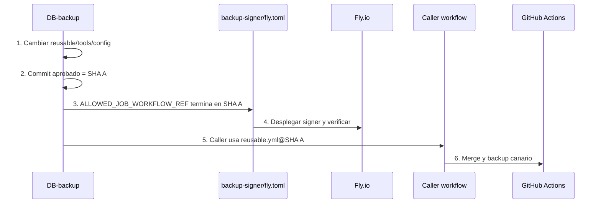

# Matriz de cambios: “toqué esto, ¿qué más debo tocar?”

Esta es la página más importante después de la instalación.

## Primero: hay dos SHA distintos

```text
SHA del reusable aprobado
≠
SHA del último commit del caller
```

El signer mira el **SHA del reusable**, porque ese es el código que realmente hace el backup.

El valor actual aprobado es:

```text
9df9f393517fffddca9e4bb7264211010cb0912b
```

## Cómo actualizar el SHA sin crear un círculo imposible



El commit que actualiza el caller puede ser un commit posterior, llamado SHA B. Eso es normal. El caller de SHA B puede apuntar al reusable aprobado de SHA A.

## Tabla de cambios

| Cambias | También debes actualizar | Después ejecuta |
|---|---|---|
| Solo documentación en `docs/` | Nada criptográfico | Guardian; el push a `main` lanza canario porque `docs/**` está vigilado |
| `backup-guardian.yml` | Copia `docs/mac-pc/backup-guardian-v4.yml` y `.github/workflows/backup-guardian.yml` | PR, Guardian estático y luego canario |
| `docs/supabase/index.ts` | Copia operativa `supabase/functions/trigger-github-backup/index.ts` y despliega Edge Function | `test-supabase-backup-e2e-v2` |
| Caller `supabase-backup-dispatch.yml` sin cambiar el SHA del reusable | Normalmente nada en signer | Guardian y canario |
| Reusable, `tools/backup/*` o los activos que el reusable carga por SHA | Nuevo SHA aprobado; `ALLOWED_JOB_WORKFLOW_REF` de `backup-signer/fly.toml`; desplegar signer; después cambiar el caller al mismo SHA | CI signer, despliegue local, Guardian y canario |
| `config/age-recipient.txt` | `BACKUP_AGE_RECIPIENT` GitHub; `BACKUP_AGE_RECIPIENT` Supabase; huella `f59fd599322f109270cfa7fd614e38b8eb7d5ca823c0443f8f0d55651e4b31aa` en reusable y Guardian; variable espejo `EXPECTED_AGE_RECIPIENT_SHA256` | E2E desde Edge Function y conservar la identidad privada antigua |
| Clave Transit o `backup-signing-public-key.pem` | Exportar nueva pública; recalcular DER SHA; actualizar reusable, Guardian y variable espejo `BACKUP_SIGNING_PUBLIC_KEY_SHA256` | Canario y prueba de restauración; conservar claves públicas antiguas |
| URL del signer | `BACKUP_SIGNER_URL` GitHub; URL esperada en reusable; valor esperado del Guardian | Desplegar signer y canario |
| Audiencia OIDC | Reusable; `GITHUB_OIDC_AUDIENCE` en signer `fly.toml`; Guardian; variable espejo `OPENBAO_OIDC_AUDIENCE` | Desplegar signer y canario |
| Rama autorizada | Checks del reusable; `ALLOWED_REF` y caller ref del signer; ruleset; variable espejo `BACKUP_ALLOWED_REF` | Desplegar signer y canario |
| Política, origen o versión de formato | Edge Function y sus secrets; caller; reusable; Guardian; variables espejo | E2E desde Edge Function |
| Tamaño de parte | `split --bytes=...` en reusable; variable espejo `BACKUP_PART_SIZE_BYTES`; documentación | Nuevo SHA, actualizar signer/caller y canario |
| Retención | Código “newest 30” del reusable; nombre de política si cambia; variable espejo `BACKUP_RETENTION_COUNT`; documentación | Nuevo SHA y canario |
| Rama de almacenamiento | Reusable, Guardian, pruebas E2E y variable espejo `BACKUP_STORAGE_BRANCH` | Nuevo SHA y canario; no incluir esa rama en ruleset de `main` |
| Timeout | `timeout-minutes` del reusable, Guardian si corresponde y variable espejo `BACKUP_TIMEOUT_MINUTES` | Nuevo SHA y canario |
| Zona horaria | Edge Function, reusable y variable espejo `BACKUP_TIMEZONE` | E2E desde Edge Function |
| Código de `backup-signer` | No cambia el reusable SHA por sí solo | CI signer, despliegue desde Mac/WSL y canario |
| `ALLOWED_JOB_WORKFLOW_REF` | Debe terminar exactamente en el SHA aprobado del reusable | Desplegar signer antes de activar el caller nuevo |
| AppRole RoleID/SecretID | Solo Fly secrets `OPENBAO_ROLE_ID` y `OPENBAO_SECRET_ID` | Desplegar/reiniciar signer y ejecutar verificador |
| `SUPABASE_DB_URL` | Solo GitHub Secret del repo `DB-backup` | Backup manual/canario; no escribirla en archivos |
| PAT de GitHub usado por Edge Function | Solo secret Supabase `GITHUB_TOKEN` | E2E desde Edge Function |
| `BACKUP_TRIGGER_SECRET` | Secret de la Edge Function y secreto `backup_trigger_secret` de Supabase Vault | E2E desde Edge Function y comprobar el cron |

## Cosas que nunca se actualizan juntas “a ciegas”

1. No cambies el caller a un SHA nuevo antes de que el signer lo autorice.
2. No borres la identidad privada `age` antigua al rotar recipient.
3. No reemplaces la clave pública vieja si aún necesitas verificar backups históricos; archívala por versión.
4. No guardes `FLY_API_TOKEN` en GitHub.
5. No crees otro OpenBao para este backup: usa el OpenBao principal con permisos `sign-only`.
