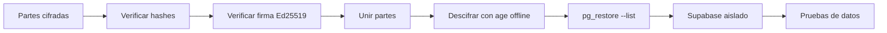

# Simulacro de recuperación

## Regla de seguridad

Nunca restaures primero sobre producción.

## Qué no restaura un `pg_dump` por sí solo

- Edge Functions desplegadas.
- Secrets de Edge Functions.
- API keys.
- Configuración externa de Auth/OAuth.
- Objetos de Storage.
- Configuración de Fly/OpenBao/GitHub.

Por eso este repositorio guarda además documentación y contratos de instalación.
