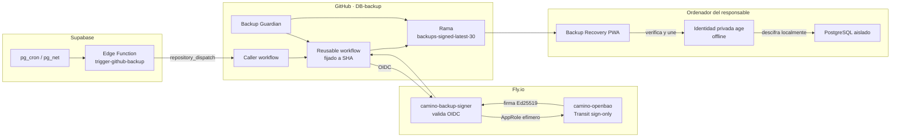
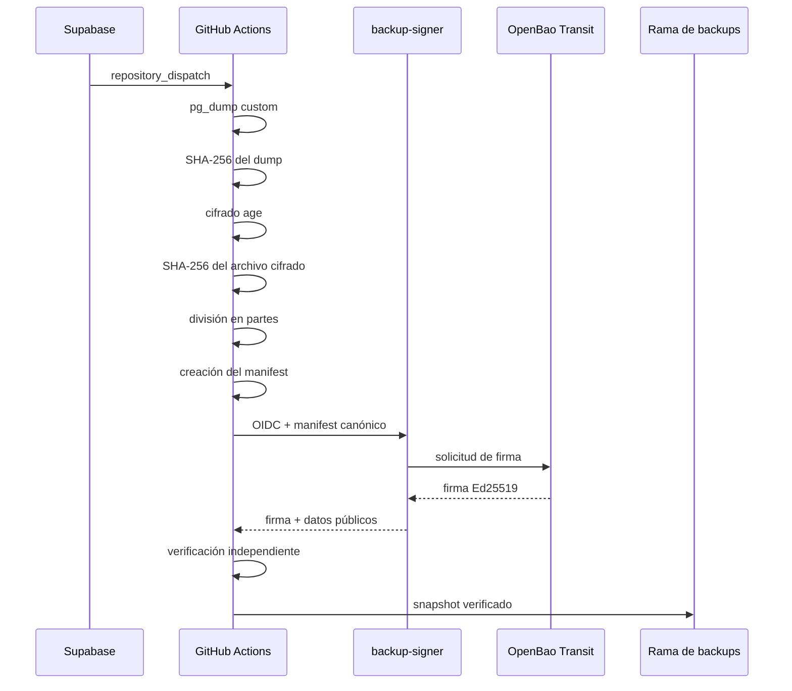
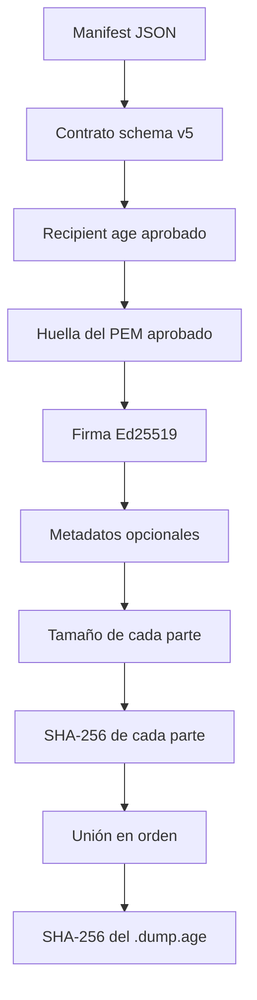
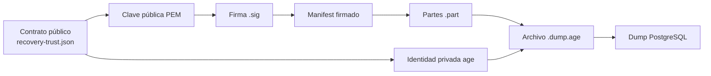

# DB Backup — creación, firma, verificación y recuperación

> Backup lógico de PostgreSQL/Supabase cifrado con `age`, dividido en partes,
> firmado con Ed25519 mediante OpenBao Transit y verificable de forma
> independiente antes de intentar una restauración.

## Herramienta web de recuperación

### [https://stjames-way.github.io/backup-recovery-pwa/](https://stjames-way.github.io/backup-recovery-pwa/)

La PWA funciona localmente en el navegador:

- no sube las partes del backup;
- no solicita tokens, RoleID ni SecretID;
- no solicita la identidad privada `age`;
- verifica manifest, firma, partes y SHA-256;
- puede unir las partes y generar un `.dump.age`;
- genera un kit de terminal para comprobar la identidad, descifrar y ejecutar
  `pg_restore --list`.

Código fuente de la PWA:

[https://github.com/StJames-way/backup-recovery-pwa](https://github.com/StJames-way/backup-recovery-pwa)

## Guía visual de recuperación

La PWA incluye un botón **Descargar guía PDF**. La misma guía se conserva en
este repositorio:

```text
docs/recovery/GUIA_RECUPERACION_PASO_A_PASO.pdf
```

Versión publicada en la web:

[https://stjames-way.github.io/backup-recovery-pwa/guia-recuperacion-backup-paso-a-paso.pdf](https://stjames-way.github.io/backup-recovery-pwa/guia-recuperacion-backup-paso-a-paso.pdf)

La guía explica, en orden:

1. cómo elegir un manifest por fecha y hora en `backups-signed-latest-30`;
2. cómo localizar la firma, los metadatos y todas las partes correspondientes;
3. qué verifica la PWA y cómo interpretar verde, amarillo y rojo;
4. cómo comprobar la identidad privada `age` sin mostrarla;
5. cómo unir las partes y obtener el `.dump.age`;
6. cómo descifrar y validar el dump con `pg_restore --list`;
7. cómo restaurarlo en PostgreSQL aislado y comprobar tablas y datos.

---

## Qué es este repositorio

`StJames-way/DB-backup` contiene el contrato, los workflows y las herramientas
que permiten crear y comprobar los backups de la base de datos.

No contiene:

```text
la identidad privada age
la clave privada Ed25519 de OpenBao
RoleID o SecretID de OpenBao
tokens de Fly, Supabase o GitHub
el dump PostgreSQL descifrado
```

Sí contiene datos públicos necesarios para verificar:

```text
recipient age aprobado
SHA-256 del recipient
clave pública Ed25519
huella SHA-256 DER de la clave pública
manifest de cada backup
firma de cada manifest
metadatos públicos de firma
hashes de cada parte
hash del archivo cifrado completo
hash del dump antes de cifrar
```

---

# Arquitectura



## Flujo de creación



---

# Qué es exactamente cada archivo y de dónde sale

## `encrypted_backups/*.part`

Ejemplo:

```text
encrypted_backups/database_backup_2026-08-02_00-24-35.dump.age.aaa.part
encrypted_backups/database_backup_2026-08-02_00-24-35.dump.age.aab.part
```

**Qué es:** fragmentos consecutivos del archivo cifrado
`database_backup_....dump.age`.

**De dónde sale:**

```text
pg_dump custom
→ database_backup_....dump
→ age
→ database_backup_....dump.age
→ split
→ archivos .part
```

**Contiene datos de la base:** sí, pero cifrados.

**Es obligatorio para recuperar:** sí, deben estar todas las partes y en el
orden que indica el manifest.

---

## `manifests/database_backup_....json`

**Qué es:** el documento central del backup. Describe:

```text
schema_version
backup_type
formato pg_dump
algoritmo de cifrado
SHA-256 del recipient age
SHA-256 del dump sin cifrar
SHA-256 del archivo cifrado
número de partes
nombre, tamaño y SHA-256 de cada parte
provenance del workflow
```

**De dónde sale:** lo genera el workflow después de crear, cifrar y dividir el
backup.

**Qué se firma:** la representación JSON canónica de este manifest.

**Es obligatorio:** sí.

---

## `signatures/database_backup_....sig`

**Qué es:** la firma Ed25519 del manifest.

**De dónde sale:**

```text
GitHub obtiene OIDC
→ backup-signer valida la identidad del workflow
→ backup-signer usa AppRole
→ OpenBao Transit firma
→ se devuelve una firma pública verificable
```

**No es:** una clave privada, un hash de las partes ni un certificado TLS.

**Es obligatorio:** sí.

---

## `signatures/database_backup_....json`

**Qué es:** metadatos públicos secundarios de la operación de firma.

Puede incluir:

```text
provider
algorithm
key_version
manifest_file
signature_file
manifest_sha256
signed_at_utc
```

**De dónde sale:** lo crea el workflow con los datos devueltos por el signer.

**No es la firma:** la firma real está en el archivo `.sig`.

**Es obligatorio:** no para la verificación Ed25519 principal. Cuando existe,
se valida como evidencia adicional.

---

## `config/backup-signing-public-key.pem`

**Qué es:** la clave pública Ed25519 que verifica las firmas de OpenBao
Transit.

**De dónde sale:** de la parte pública de la clave Transit:

```text
transit-backup/keys/supabase-backup-manifest
```

La clave privada nunca sale de OpenBao.

Huella SHA-256 de la clave en formato DER:

```text
4011dd69e227bfcf6f39b3f44b1ad499d2a582c9f3eed93d8896e61b7485ce96
```

**Es pública:** sí.

**Es obligatoria:** sí, aunque la PWA ya lleva una copia aprobada incluida.

---

## `config/backup-recovery-trust.json`

**Qué es:** el contrato público y estable de recuperación.

Contiene:

```json
{
  "encryption": {
    "algorithm": "age",
    "approved_recipient": "age18gt5e7d48tfyhx4552kc5wyp52lt5rf34ag0sat3t4xsrg0fqg8stagvae",
    "approved_recipient_sha256": "f59fd599322f109270cfa7fd614e38b8eb7d5ca823c0443f8f0d55651e4b31aa"
  },
  "signature": {
    "algorithm": "ed25519",
    "provider": "backup-signer-openbao-transit",
    "public_key_sha256_der": "4011dd69e227bfcf6f39b3f44b1ad499d2a582c9f3eed93d8896e61b7485ce96"
  }
}
```

**De dónde sale:** es una política mantenida en este repositorio. No la genera
cada backup.

**Para qué sirve:** evita aceptar accidentalmente:

```text
un backup cifrado para otro recipient
otra clave pública de firma
otro proveedor de firma
otro contrato de backup
```

**Es evidencia de un backup concreto:** no. Es la política pública contra la
que se compara la evidencia de cada backup.

---

## `tools/backup/validate_recovery_trust.py`

**Qué es:** un validador local del contrato público.

Comprueba:

```text
que el recipient tenga forma age1...
que su SHA-256 coincida
que el PEM sea válido
que la huella DER del PEM coincida
```

No lee la identidad privada.

---

## Identidad privada `age`

Ejemplo local:

```text
$HOME/claves/camino-backup-identity.txt
```

**Qué es:** la única identidad capaz de descifrar los backups existentes para
el recipient aprobado.

**De dónde sale:** fue generada fuera del repositorio mediante `age-keygen`.

**Dónde debe estar:** en custodia offline o almacenamiento local protegido.

**Dónde no debe estar:**

```text
GitHub
GitHub Pages
Supabase
Fly.io
OpenBao Transit
logs
issues
chats
kit de recuperación
```

---

# Datos públicos aprobados

## Recipient `age`

```text
age18gt5e7d48tfyhx4552kc5wyp52lt5rf34ag0sat3t4xsrg0fqg8stagvae
```

## SHA-256 del recipient

```text
f59fd599322f109270cfa7fd614e38b8eb7d5ca823c0443f8f0d55651e4b31aa
```

El hash se calcula sobre los bytes UTF-8 del recipient **sin salto de línea**:

```bash
printf '%s' 'age18gt5e7d48tfyhx4552kc5wyp52lt5rf34ag0sat3t4xsrg0fqg8stagvae' |
shasum -a 256
```

El guion final que muestra `shasum` significa “entrada estándar”. No forma
parte del hash.

## Clave pública de firma

```text
config/backup-signing-public-key.pem
```

Huella DER:

```text
4011dd69e227bfcf6f39b3f44b1ad499d2a582c9f3eed93d8896e61b7485ce96
```

Comprobarla:

```bash
openssl pkey   -pubin   -in config/backup-signing-public-key.pem   -outform DER |
shasum -a 256
```

---

# Verificación rápida del repositorio

Desde la raíz de `DB-backup`:

```bash
python3 tools/backup/validate_recovery_trust.py
```

Resultado esperado:

```text
VERDE: contrato público de recuperación correcto
Recipient: age18gt5e7d48tfyhx4552kc5wyp52lt5rf34ag0sat3t4xsrg0fqg8stagvae
Recipient SHA-256: f59fd599322f109270cfa7fd614e38b8eb7d5ca823c0443f8f0d55651e4b31aa
Signing key SHA-256 DER: 4011dd69e227bfcf6f39b3f44b1ad499d2a582c9f3eed93d8896e61b7485ce96
```

Esto verifica el contrato público. No verifica todavía un backup concreto.

---

# Comprobar la identidad privada local

```bash
IDENTITY="$HOME/claves/camino-backup-identity.txt"

RECIPIENT="$(
  age-keygen -y "$IDENTITY"
)"

printf 'Recipient: %s\n' "$RECIPIENT"

printf '%s' "$RECIPIENT" |
shasum -a 256
```

Debe coincidir exactamente con:

```text
Recipient:
age18gt5e7d48tfyhx4552kc5wyp52lt5rf34ag0sat3t4xsrg0fqg8stagvae

SHA-256:
f59fd599322f109270cfa7fd614e38b8eb7d5ca823c0443f8f0d55651e4b31aa
```

Una identidad nueva no puede recuperar los backups antiguos.

---

# Recuperación mediante la PWA

Abre:

[https://stjames-way.github.io/backup-recovery-pwa/](https://stjames-way.github.io/backup-recovery-pwa/)

## Archivos que debes descargar

La forma recomendada es conservar la estructura:

```text
backup-descargado/
├── encrypted_backups/
│   ├── database_backup_....aaa.part
│   └── database_backup_....aab.part
├── manifests/
│   └── database_backup_....json
└── signatures/
    ├── database_backup_....sig
    └── database_backup_....json
```

También se admite una carpeta plana con las partes directamente dentro.

## Qué verifica la PWA



## Qué no hace la PWA

La PWA no:

```text
descifra con la identidad privada
ejecuta age directamente en el navegador
ejecuta pg_restore
restaura PostgreSQL
demuestra por sí sola una recuperación completa
```

Cuando une las partes, el resultado:

```text
database_backup_....dump.age
```

**sigue cifrado**.

---

# Kit de terminal generado por la PWA

El ZIP generado por la web incluye:

```text
README.txt
recovery-plan.json
recovery-trust.json
check-age-identity.sh
check-age-identity.ps1
verify-and-join.sh
verify-and-join.ps1
decrypt-and-check.sh
decrypt-and-check.ps1
evidence/
```

## `recovery-plan.json`

Datos específicos del backup seleccionado:

```text
nombre del manifest
número de partes
orden de partes
tamaños
SHA-256 de partes
SHA-256 cifrado
SHA-256 del dump
recipient aprobado
huella de firma
```

## `recovery-trust.json`

Copia del contrato público de la PWA. No contiene secretos.

## `check-age-identity.*`

Deriva el recipient desde la identidad privada y lo compara con el recipient y
SHA-256 aprobados.

## `verify-and-join.*`

Verifica las partes y crea el `.dump.age`.

## `decrypt-and-check.*`

Comprueba la identidad, descifra, valida el SHA-256 del dump y ejecuta
`pg_restore --list`.

## `evidence/`

Copia los documentos pequeños que la PWA utilizó:

```text
manifest
firma .sig
metadatos opcionales
clave pública PEM
contrato público
```

Las partes grandes no se duplican dentro del kit.

---

# Procedimiento completo de recuperación

## Paso 0 — Comprobar identidad

```bash
./check-age-identity.sh   "$HOME/claves/camino-backup-identity.txt"
```

## Paso 1 — Verificar y unir

```bash
./verify-and-join.sh   "$HOME/Downloads"
```

Resultado:

```text
database_backup_....dump.age
```

## Paso 2 — Descifrar y comprobar

```bash
./decrypt-and-check.sh   "./database_backup_....dump.age"   "$HOME/claves/camino-backup-identity.txt"
```

Resultado:

```text
database_backup_....dump
database_backup_....dump.contents.txt
```

## Paso 3 — Restauración real

`pg_restore --list` comprueba que existe un catálogo PostgreSQL válido, pero no
demuestra una restauración.

La prueba final debe ser:

```text
crear PostgreSQL aislado
restaurar el dump
comprobar esquemas
comprobar tablas
comprobar filas críticas
documentar el resultado
```

No deben eliminarse los backups históricos hasta completar este simulacro.

---

# Cadena de confianza



Una comprobación verde requiere que todas las relaciones coincidan.

---

# Ramas

## `main`

Contiene:

```text
workflows
herramientas
documentación
clave pública
contrato de confianza
```

## `backups-signed-latest-30`

Contiene los 30 snapshots verificados más recientes:

```text
encrypted_backups/
manifests/
signatures/
```

No debe mezclarse el código de la PWA con esta rama de almacenamiento.

---

# Backup Guardian

El Guardian debe comprobar como mínimo:

```text
sintaxis de scripts
ausencia de claves privadas
contrato de secretos
SHA fijado del reusable
huella de la clave pública
contrato de recuperación
backup sintético
canario real cuando corresponda
```

Paso recomendado:

```yaml
- name: Validate public recovery trust contract
  run: |
    python3 tools/backup/validate_recovery_trust.py
```

---

# Cambios que requieren actualización coordinada

| Cambio | Elementos que deben actualizarse |
|---|---|
| Rotación de identidad `age` | recipient, SHA-256, Supabase, GitHub, manifest, PWA, README y custodia |
| Rotación de clave Transit | PEM, huella DER, signer, Guardian, PWA y README |
| Cambio de `schema_version` | workflow, manifest, verificadores, PWA y documentación |
| Cambio de formato de partes | workflow, manifest, PWA y scripts del kit |
| Cambio del reusable | SHA del caller, allowlist del signer y Guardian |
| Cambio de URL de la PWA | README principal y documentación |

---

# Reglas de seguridad

```text
No subir la identidad privada age.
No imprimirla.
No copiarla dentro del kit.
No usar una identidad nueva para backups antiguos.
No aceptar un manifest dirigido a otro recipient.
No aceptar una clave pública distinta sin una rotación documentada.
No usar @main para el reusable autorizado.
No considerar recuperable un backup solo porque exista.
No borrar históricos antes de una restauración completa.
```

---

# Enlaces

- Repositorio principal: [https://github.com/StJames-way/DB-backup](https://github.com/StJames-way/DB-backup)
- PWA de recuperación: [https://stjames-way.github.io/backup-recovery-pwa/](https://stjames-way.github.io/backup-recovery-pwa/)
- Código fuente de la PWA: [https://github.com/StJames-way/backup-recovery-pwa](https://github.com/StJames-way/backup-recovery-pwa)

---

# Criterio de éxito

```text
BACKUP CREADO
BACKUP CIFRADO
BACKUP FIRMADO
BACKUP PUBLICADO
BACKUP VERIFICADO
IDENTIDAD COMPROBADA
BACKUP DESCIFRADO
CATÁLOGO PG_RESTORE VÁLIDO
BACKUP RESTAURADO EN POSTGRESQL AISLADO
```

Solo el último conjunto completo demuestra que el backup es realmente
recuperable.
